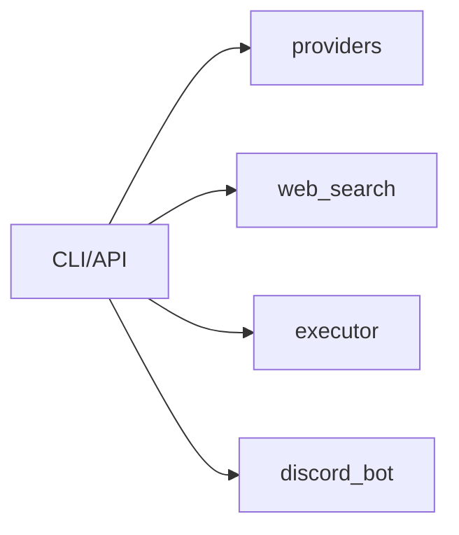

# AI-Toolbox 🤖

[](https://www.python.org/downloads/)
[](https://opensource.org/licenses/MIT)
[](https://github.com/unlimblue/ai-toolbox/stargazers)

> **统一 AI 模型调用接口** - Kimi / OpenRouter / 网络搜索 / 沙盒执行

## 架构



## 快速开始

```bash
pip install -e .
export KIMI_API_KEY=your_key
```

## 使用

```python
from ai_toolbox import create_provider
client = create_provider("kimi", api_key="your_key")
```

```bash
ai-toolbox chat -p "你好"
ai-toolbox search -q "Python 教程"
ai-toolbox exec -c "ls -la"
```

## 工具矩阵

| 工具 | CLI | API | Python |
|------|-----|-----|--------|
| providers | ✅ | ✅ | ✅ |
| web_search | ✅ | ✅ | ✅ |
| executor | ✅ | ✅ | ✅ |
| discord_bot | - | - | ✅ |

## ⭐ Star History

[](https://star-history.com/#unlimblue/ai-toolbox&Date)

## License

MIT