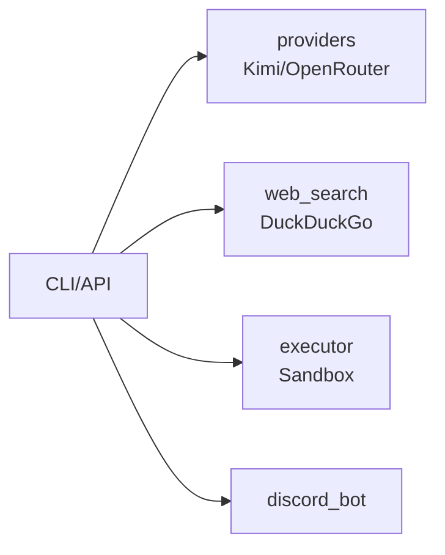

# AI-Toolbox 🤖

[](https://www.python.org/downloads/)
[](https://opensource.org/licenses/MIT)
[](https://github.com/unlimblue/ai-toolbox/stargazers)

> **统一 AI 模型调用接口** - Kimi / OpenRouter / 网络搜索 / 沙盒执行

## 快速开始

```bash
# 安装
pip install -e .

# 配置 API Keys
export KIMI_API_KEY=your_kimi_key
export OPENROUTER_API_KEY=your_openrouter_key
```

---

## 🛠️ 工具矩阵

| 工具 | 描述 | CLI | API | Python |
|------|------|-----|-----|--------|
| **providers** | AI 对话 (Kimi, OpenRouter) | `ai-toolbox chat -p "你好"` | `POST /v1/chat/completions` | `create_provider("kimi", api_key)` |
| **web_search** | 网络搜索 (DuckDuckGo) | `ai-toolbox search -q "Python"` | `GET /v1/search?q=Python` | `WebSearchTool().execute("Python")` |
| **executor** | 沙盒执行 shell/python | `ai-toolbox exec -c "ls -la"` | `POST /v1/execute` | `SandboxExecutor().run("ls -la")` |
| **discord_bot** | Discord 机器人 | - | - | `python -m ai_toolbox.discord_bot` |

---

## 📖 使用示例

### 1. Providers - AI 对话

**CLI:**
```bash
ai-toolbox chat -p "你好，请介绍自己"
ai-toolbox chat -p "讲个笑话" -p openrouter
ai-toolbox models                    # 列出可用模型
```

**API:**
```bash
curl -X POST http://localhost:8000/v1/chat/completions \
  -H "Content-Type: application/json" \
  -d '{"provider": "kimi", "messages": [{"role": "user", "content": "你好"}]}'
```

**Python:**
```python
from ai_toolbox import create_provider
from ai_toolbox.providers import ChatMessage

client = create_provider("kimi", api_key="your_key")
messages = [ChatMessage(role="user", content="你好")]
response = await client.chat(messages)
print(response.content)
```

---

### 2. Web Search - 网络搜索

**CLI:**
```bash
ai-toolbox search -q "Python 3.12 新特性"
ai-toolbox search -q "最新 AI 新闻"
```

**API:**
```bash
curl "http://localhost:8000/v1/search?q=Python教程"
```

**Python:**
```python
from ai_toolbox.web_search import WebSearchTool

search = WebSearchTool(max_results=5)
results = await search.execute("Python 教程")
print(results)
```

---

### 3. Executor - 沙盒执行

**CLI:**
```bash
# 执行 shell 命令
ai-toolbox exec -c "ls -la"
ai-toolbox exec -c "pwd" -t 10

# 执行脚本
ai-toolbox script -s "print('Hello World')" -l python
ai-toolbox script -s "echo $HOME" -l bash
```

**API:**
```bash
# 执行命令
curl -X POST http://localhost:8000/v1/execute \
  -H "Content-Type: application/json" \
  -d '{"command": "ls -la", "timeout": 30}'
```

**Python:**
```python
from ai_toolbox.executor import SandboxExecutor

# 执行 shell 命令
executor = SandboxExecutor(timeout=30)
result = await executor.run("ls -la")
print(result.stdout)

# 执行脚本
result = await executor.run_script("print('hello')", language="python")
print(result.stdout)
```

---

### 4. Discord Bot

**启动:**
```bash
export DISCORD_TOKEN=your_discord_token
python -m ai_toolbox.discord_bot
```

**命令:**
- `/chat <prompt>` - 与 AI 对话
- `/models` - 列出可用模型

---

## 🏗️ 架构



---

## API 端点

| 端点 | 方法 | 描述 | 示例 |
|------|------|------|------|
| `/health` | GET | 健康检查 | `curl /health` |
| `/v1/models` | GET | 列出模型 | `curl /v1/models?provider=kimi` |
| `/v1/chat/completions` | POST | AI 对话 | `curl -X POST -d '{"messages":[...]}'` |
| `/v1/search` | GET | 网络搜索 | `curl "/v1/search?q=Python"` |
| `/v1/execute` | POST | 沙盒执行 | `curl -X POST -d '{"command":"ls"}'` |

---

## ⭐ Star History

[](https://star-history.com/#unlimblue/ai-toolbox&Date)

---

## License

MIT © unlimblue