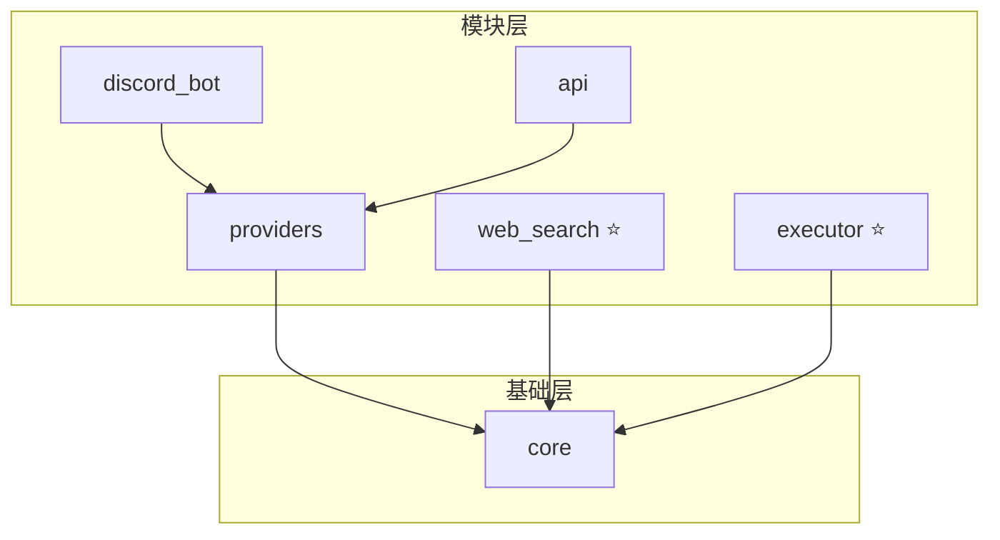

# AI-Toolbox 🤖

[](https://www.python.org/downloads/)
[](https://opensource.org/licenses/MIT)
[](./tests/)
[](https://github.com/unlimblue/ai-toolbox/stargazers)

> **AI 工具箱** - 统一 AI 模型调用接口，模块化设计，支持 Discord Bot 和 RESTful API

## ✨ 特性

- 🤖 **多模型支持** - Kimi (Moonshot)、OpenRouter (Claude、GPT、Gemini 等)
- 🔍 **网络搜索** - DuckDuckGo 搜索，无需 API Key
- ⚡ **任务执行器** - 异步执行、并发控制、超时重试
- 💬 **多种接口** - Python / CLI / RESTful API / Discord Bot
- 🖼️ **多模态** - 图像理解、视觉分析
- 🧪 **测试驱动** - 单元测试覆盖核心模块

## 📁 项目结构

```
ai-toolbox/
├── src/ai_toolbox/
│   ├── core/              # 核心配置和日志
│   ├── providers/         # AI 提供商 (Kimi, OpenRouter)
│   ├── web_search/        # 网络搜索模块 ⭐
│   ├── executor/          # 任务执行器模块 ⭐
│   ├── discord_bot/       # Discord Bot (基础版)
│   └── api/               # RESTful API
├── tests/                 # 单元测试
├── docs/                  # 文档
└── examples/              # 示例代码
```

## 🚀 快速开始

### 安装

```bash
git clone https://github.com/unlimblue/ai-toolbox.git
cd ai-toolbox
python3 -m venv .venv
source .venv/bin/activate
pip install -e ".[dev]"
```

### 配置

```bash
cp .env.example .env
# 编辑 .env 填入 API Keys
```

```bash
KIMI_API_KEY=your_kimi_api_key
OPENROUTER_API_KEY=your_openrouter_api_key
DISCORD_TOKEN=your_discord_token  # 可选
```

## 📖 模块使用

### 1. Providers - AI 模型

```python
from ai_toolbox import create_provider

client = create_provider("kimi", api_key="your_key")

from ai_toolbox.providers import ChatMessage
messages = [ChatMessage(role="user", content="你好")]
response = await client.chat(messages)
print(response.content)
```

### 2. Web Search - 网络搜索 ⭐

```python
from ai_toolbox.web_search import WebSearchTool

search = WebSearchTool()
results = await search.execute("Python 教程")
print(results)
```

### 3. Executor - 任务执行器 ⭐

```python
from ai_toolbox.executor import AsyncExecutor

executor = AsyncExecutor(max_workers=4)

# 执行异步函数
result = await executor.execute(my_async_function, args)

# 批量执行
tasks = [(func1, args1, {}), (func2, args2, {})]
results = await executor.execute_batch(tasks)

# 带重试执行
result = await executor.execute_with_retry(
    func, args, max_retries=3
)
```

### 4. Discord Bot

```bash
# 启动 Discord Bot
python -m ai_toolbox.discord_bot
```

斜杠命令：
- `/chat` - 与 AI 对话
- `/models` - 查看可用模型
- `/help` - 显示帮助

### 5. CLI

```bash
# 基础对话
ai-toolbox chat -p "你好"

# 列出模型
ai-toolbox models
```

## 🏗️ 架构设计



## 🧪 测试

```bash
pytest -v
```

## 📚 文档

- [架构设计](docs/architecture.md)
- [Providers](docs/providers.md)
- [Web Search](docs/web_search.md)
- [Executor](docs/executor.md)
- [Discord Bot](docs/discord_bot.md)

## 📄 许可

[MIT](LICENSE) © unlimblue