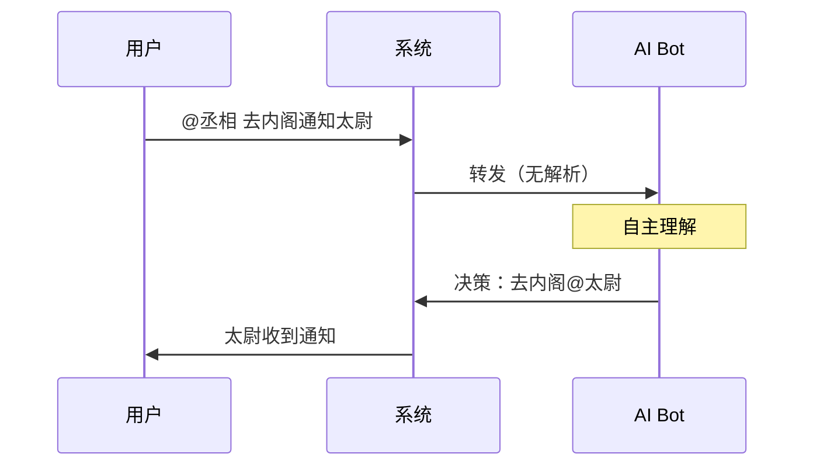

<div align="center">

# 🤖 AI-Toolbox

**让 AI Bots 自主协作**

[](https://github.com/unlimblue/ai-toolbox)
[](https://www.python.org/)
[](LICENSE)

<p align="center">
  
  
  
</p>

**"去内阁通知太尉" —— AI 自主决定在正确的频道 @ 正确的人**

</div>

---

<div align="center">

## ⭐ Star History

[](https://star-history.com/#unlimblue/ai-toolbox)

</div>

---

## 🎯 核心特性

### ✨ 自主决策架构



**无硬编码解析** —— AI 完全自主理解指令、选择频道、@对象

### 🧠 Context Graph

```mermaid
graph LR
    A[用户@丞相] --> B[丞相理解]
    B --> C[内阁@太尉]
    C --> D[太尉回应]
    D --> E[丞相汇报]
    
    style A fill:#ff9
    style C fill:#9f9
    style E fill:#99f
```

**自动上下文管理** —— 跨频道对话历史连贯，多轮对话自然流畅

### 🔧 配置驱动

```yaml
bots:
  my_bot:
    name: "新角色"
    persona:
      custom_instructions: |
        你可以自主决定在哪个频道发送消息...
```

**无需代码** —— YAML 配置即可添加新角色

---

## 🚀 快速开始

```bash
# 安装
git clone https://github.com/unlimblue/ai-toolbox.git
cd ai-toolbox
pip install -e .

# 配置环境变量
export KIMI_API_KEY="your_key"
export HUB_BOT_TOKEN="your_token"

# 启动
./scripts/multi_bot.sh start
```

---

## 💡 使用示例

### 基础对话

```
金銮殿> @丞相 查询政务
丞相: 启禀陛下，今日政务如下...
```

### 跨频道任务

```
金銮殿> @丞相 @太尉 去内阁商议边防

内阁> 丞相: @太尉 请前来商议
内阁> 太尉: 丞相大人，边防方案...
金銮殿> 丞相: 启禀陛下，商议完毕：...
```

### 多轮对话

```
金銮殿> @丞相 与太尉讨论后决定

[内阁]
丞相: @太尉 此事如何？
太尉: 臣以为可行...
丞相: @太尉 还有补充？
太尉: 没有了，请定夺。

[金銮殿]
丞相: 启禀陛下，商议已定...
```

---

## 📚 文档

| 文档 | 说明 |
|------|------|
| [设计哲学](docs/PHILOSOPHY.md) | 核心设计理念 |
| [系统架构](docs/ARCHITECTURE.md) | 详细架构设计 |
| [部署指南](docs/DEPLOYMENT.md) | 快速部署 |
| [Multi-Bot](docs/multi-bot/) | 多Bot系统详情 |

---

## 🛠️ 其他工具

AI-Toolbox 还包含以下工具：

| 工具 | 说明 | 文档 |
|------|------|------|
| `web_search` | 网页搜索 | [查看](docs/tools/web_search.md) |
| `executor` | 代码执行沙箱 | [查看](docs/tools/executor.md) |
| `github` | GitHub 管理 | [查看](docs/tools/github.md) |

---

## 📄 许可证

[MIT](LICENSE) © 2024 unlimblue

---

<div align="center">

**⭐ 如果这个项目对你有帮助，请给个 Star！**

[GitHub](https://github.com/unlimblue/ai-toolbox) | [Issues](https://github.com/unlimblue/ai-toolbox/issues)

</div>
