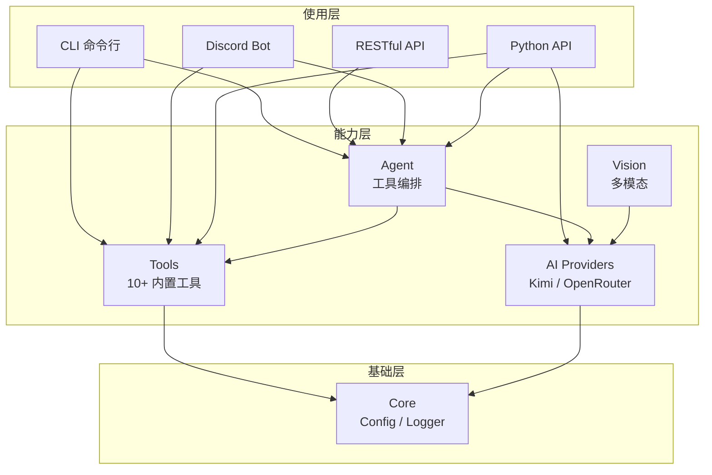

# AI-Toolbox 🤖

[](https://www.python.org/downloads/)
[](https://opensource.org/licenses/MIT)
[](./tests/)
[](https://github.com/unlimblue/ai-toolbox/stargazers)

> **AI 工具箱** - 统一 AI 模型调用接口，支持工具调用、多模态、Discord Bot 和 RESTful API

<p align="center">
  
</p>

## ✨ 特性

- 🤖 **多模型支持** - Kimi (Moonshot)、OpenRouter (Claude、GPT、Gemini 等)
- 🛠️ **工具调用** - 10+ 内置工具，支持自定义工具
- 🖼️ **多模态** - 图像理解、视觉分析
- 💬 **多种接口** - Python / CLI / RESTful API / Discord Bot
- 🔧 **Agent 模式** - 自动工具选择，智能对话
- 🆓 **免费搜索** - DuckDuckGo 网络搜索，无需 API Key
- 🧪 **测试驱动** - 99+ 单元测试，覆盖率 46%

## 🚀 快速开始

### 安装

```bash
# 克隆仓库
git clone https://github.com/unlimblue/ai-toolbox.git
cd ai-toolbox

# 创建虚拟环境
python3 -m venv .venv
source .venv/bin/activate  # Windows: .venv\Scripts\activate

# 安装
pip install -e ".[dev]"
```

### 配置

复制 `.env.example` 为 `.env` 并填入 API Keys：

```bash
cp .env.example .env
# 编辑 .env 填入你的 API Keys
```

```bash
# AI Provider API Keys
KIMI_API_KEY=your_kimi_api_key
OPENROUTER_API_KEY=your_openrouter_api_key

# Discord Bot (可选)
DISCORD_TOKEN=your_discord_bot_token
```

### 运行测试

```bash
# 运行所有测试
pytest

# 带覆盖率
pytest --cov=ai_toolbox --cov-report=html
```

## 📖 使用示例

### 1. 基础对话

```python
import asyncio
from ai_toolbox import create_provider

async def main():
    client = create_provider("kimi", api_key="your_key")
    
    from ai_toolbox.providers import ChatMessage
    messages = [ChatMessage(role="user", content="你好")]
    
    response = await client.chat(messages)
    print(response.content)
    
    await client.close()

asyncio.run(main())
```

### 2. Agent 工具调用

```python
import asyncio
from ai_toolbox import Agent, create_provider
from ai_toolbox.tools import ToolRegistry, calculator_tool

async def main():
    # 创建 Provider
    client = create_provider("openrouter", api_key="your_key")
    
    # 创建工具注册表
    registry = ToolRegistry()
    registry.register(calculator_tool)
    
    # 创建 Agent
    agent = Agent(client, registry)
    
    # Agent 自动选择工具
    response = await agent.run("计算 123 * 456")
    print(response)  # 56088
    
    await client.close()

asyncio.run(main())
```

### 3. 图像分析

```python
import asyncio
from ai_toolbox.providers import KimiClient, ImageContent

async def main():
    client = KimiClient(api_key="your_key")
    
    # 从文件
    image = ImageContent.from_file("photo.jpg")
    
    # 从 URL
    # image = ImageContent.from_url("https://example.com/photo.jpg")
    
    response = await client.chat_with_image(
        "描述这张图片",
        [image]
    )
    print(response.content)
    
    await client.close()

asyncio.run(main())
```

### 4. 网络搜索

```python
import asyncio
from ai_toolbox.tools import WebSearchTool

async def main():
    search = WebSearchTool()
    results = await search.execute("Python 3.12 新特性")
    print(results)

asyncio.run(main())
```

## 🏗️ 架构设计



## 📁 项目结构

```
ai-toolbox/
├── src/ai_toolbox/
│   ├── core/              # 核心配置和日志
│   ├── providers/         # AI 提供商 (Kimi, OpenRouter)
│   ├── tools/             # 工具系统 (10+ 工具)
│   ├── agent.py           # Agent 编排
│   ├── cli/               # 命令行接口
│   ├── api/               # RESTful API
│   └── discord_bot/       # Discord Bot
├── tests/                 # 单元测试 (99+)
├── docs/                  # 文档
├── examples/              # 示例代码
└── README.md             # 本文件
```

## 🛠️ 工具列表

| 工具 | 功能 | 使用场景 |
|------|------|----------|
| `calculator` | 🧮 安全数学计算 | 数学问题求解 |
| `get_current_time` | 🕐 时区时间获取 | 需要当前时间 |
| `random_number` | 🎲 随机数生成 | 随机选择 |
| `random_choice` | 🎯 随机选择 | 从选项中选择 |
| `count_words` | 📝 文本统计 | 分析文本长度 |
| `format_json` | 📋 JSON 格式化 | 美化 JSON |
| `read_file` | 📄 文件读取 | 读取代码/文档 |
| `list_directory` | 📁 目录列表 | 浏览文件 |
| `web_search` | 🔍 网络搜索 | 获取最新信息 |
| `web_search_news` | 📰 新闻搜索 | 最新新闻 |

## 💻 CLI 使用

```bash
# 基础对话
ai-toolbox chat -p "你好"

# Agent 工具调用
ai-toolbox agent -p "计算 2**10" -t calculator

# 图像分析
ai-toolbox vision -i photo.jpg -p "描述图片"

# 网络搜索
ai-toolbox agent -p "最新 AI 新闻" -t web_search

# 列出模型
ai-toolbox models
```

## 🤖 Discord Bot

### 斜杠命令

```
/chat    - 与 AI 对话
/ask     - 智能问答（自动工具）
/calc    - 计算器
/time    - 当前时间
/search  - 网络搜索
/news    - 新闻搜索
/tools   - 列出工具
```

### Agent 频道

```
# 管理员设置
/set_agent_channel    - 启用 Agent 模式
/unset_agent_channel  - 禁用 Agent 模式

# 在 Agent 频道中直接对话
用户: 计算 123 * 456
Bot: 🧮 123 * 456 = 56088

用户: 搜索 Python 教程
Bot: 🔍 [搜索结果...]
```

## 📚 文档

| 文档 | 说明 |
|------|------|
| [架构设计](docs/architecture.md) | 详细架构设计 |
| [Providers](docs/providers.md) | AI 提供商接口 |
| [Tools](docs/tools.md) | 工具系统文档 |
| [CLI](docs/cli.md) | 命令行使用指南 |
| [API](docs/api.md) | RESTful API 文档 |
| [Discord Bot](docs/discord_bot.md) | Discord Bot 指南 |

## 🧪 测试

```bash
# 运行所有测试
pytest -v

# 运行特定模块测试
pytest tests/unit/test_tools.py -v
pytest tests/unit/test_agent.py -v

# 覆盖率报告
pytest --cov=ai_toolbox --cov-report=html
```

## 📊 Star History

[](https://star-history.com/#unlimblue/ai-toolbox&Date)

## 🤝 贡献

欢迎提交 Issue 和 PR！

1. Fork 本仓库
2. 创建特性分支 (`git checkout -b feature/AmazingFeature`)
3. 提交更改 (`git commit -m 'Add some AmazingFeature'`)
4. 推送分支 (`git push origin feature/AmazingFeature`)
5. 创建 Pull Request

## 📄 许可

[MIT](LICENSE) © unlimblue

---

<p align="center">
  Made with ❤️ by <a href="https://github.com/unlimblue">unlimblue</a>
</p>