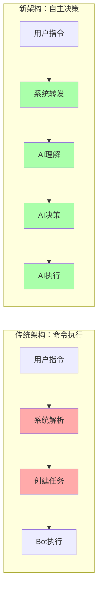
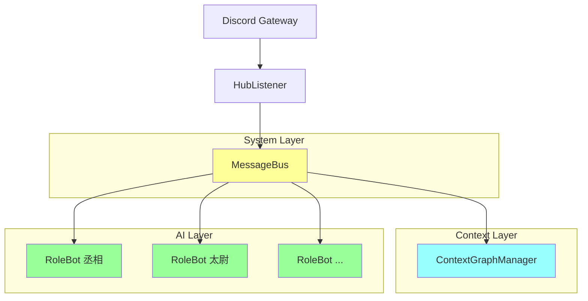
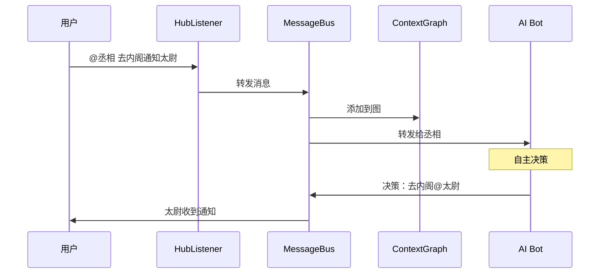
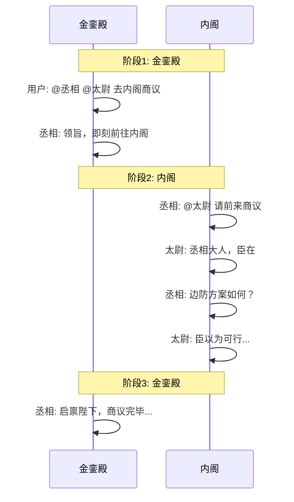
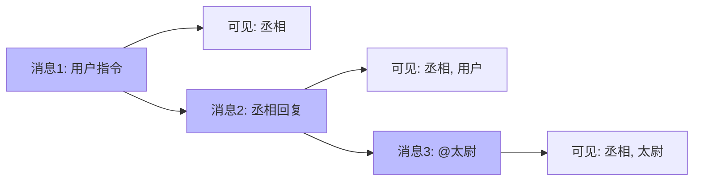
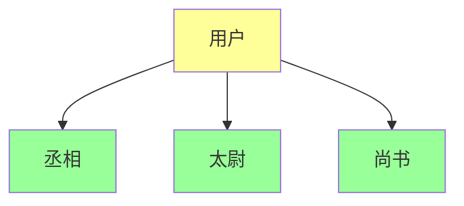
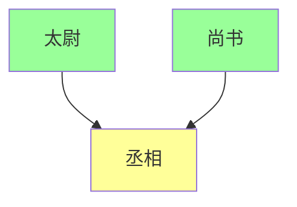
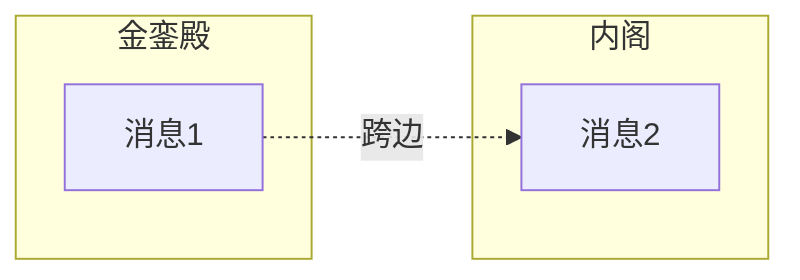

# AI-Toolbox 架构文档

**版本**: 2.0  
**日期**: 2026-03-06  
**架构**: 自主决策架构 + Context Graph

---

## 目录

1. [设计哲学](#设计哲学)
2. [系统架构](#系统架构)
3. [核心组件](#核心组件)
4. [数据流](#数据流)
5. [Context Graph 机制](#context-graph-机制)
6. [自主决策流程](#自主决策流程)
7. [扩展性设计](#扩展性设计)

---

## 设计哲学

### 从命令执行到自主决策



**转变**: 红色=硬编码限制，绿色=自主灵活

### 核心设计原则

| 原则 | 说明 | 实现 |
|------|------|------|
| **无硬编码** | 不预设任何指令模式 | MessageBus 只转发，不解析 |
| **上下文感知** | 维护完整对话历史 | Context Graph 自动计算可见性 |
| **自主决策** | AI 决定在哪里说什么 | RoleBot JSON 格式决策 |
| **配置驱动** | 通过 YAML 定义角色 | 无需代码即可添加新 Bot |

---

## 系统架构

### 整体架构图



### 组件职责

| 组件 | 职责 | 不做什么 |
|------|------|----------|
| **HubListener** | Discord 消息监听、格式转换 | 不解析内容、不决策 |
| **MessageBus** | 消息路由、ContextGraph 维护 | 不解析指令、不创建任务 |
| **ContextGraphManager** | 图存储、可见性计算、子图提取 | 不决策、不干预 |
| **RoleBot** | 接收消息+上下文、AI 决策、执行动作 | 不硬编码逻辑 |

---

## 核心组件

### 1. MessageBus

**职责**: 消息路由 + ContextGraph 维护

**关键设计**: 无解析

```python
class MessageBus:
    async def publish(self, message: UnifiedMessage):
        # 1. 添加到 ContextGraph（无解析）
        graph_id = self._get_graph_id(message.channel_id)
        self.graph_manager.add_message(graph_id, message)
        
        # 2. 转发给被 @ 的 Bot（直接转发）
        for bot_id in message.mentions:
            await self.role_bots[bot_id].handle_message(message, graph_id)
```

**为什么不做解析？**
- 避免硬编码指令模式
- 让 AI 自主理解用户意图
- 支持任意复杂的自然语言指令

### 2. ContextGraphManager

**职责**: 存储对话历史、计算可见性、提取相关上下文

**数据模型**:

```python
@dataclass
class MessageNode:
    id: str
    author_id: str
    content: str
    channel_id: str
    parents: List[str]          # 父消息（回复关系）
    children: List[str]         # 子消息
    visible_to: Set[str]        # 可见的 Bot IDs
    mention_targets: List[str]  # 被 @ 的 Bot IDs
```

**可见性传播算法**:

```python
def _calculate_visibility(self, graph: ContextGraph, node: MessageNode):
    visible = set()
    
    # 基础可见性
    visible.add(node.author_id)           # 作者可见
    visible.update(node.mention_targets)  # 被 @ 的可见
    
    # 从父节点继承
    for parent_id in node.parents:
        if parent_id in graph.nodes:
            visible.update(graph.nodes[parent_id].visible_to)
    
    node.visible_to = visible
```

**子图提取**:

```python
def extract_subgraph(self, graph_id: str, bot_id: str, limit: int = 20):
    """
    为 Bot 提取可见的消息子图
    只返回对该 Bot 可见的消息
    """
    graph = self.graphs[graph_id]
    
    # 过滤可见节点
    visible_nodes = {
        node_id for node_id, node in graph.nodes.items()
        if bot_id in node.visible_to
    }
    
    # 拓扑排序
    sorted_nodes = self._topological_sort(visible_nodes)
    
    return SubGraph(nodes=visible_nodes, sorted_order=sorted_nodes)
```

### 3. RoleBot

**职责**: 接收消息+上下文、AI 自主决策、执行动作

**决策流程**:

```python
async def handle_message(self, message: UnifiedMessage, graph_id: str):
    # 1. 获取上下文
    context = self.graph_manager.get_context_for_bot(graph_id, self.bot_id)
    
    # 2. 构建决策 Prompt
    decision_prompt = self._build_decision_prompt(message, context)
    
    # 3. AI 决策（JSON 格式）
    actions = await self._ai_decide(decision_prompt)
    # actions: [{"channel_id": "...", "content": "...", "reason": "..."}]
    
    # 4. 执行动作
    for action in actions:
        await self.send_message(action["channel_id"], action["content"])
```

**决策 Prompt 示例**:

```
你收到了一条消息，需要自主决定如何响应。

## 你的信息
- 身份: 丞相
- 位置: 金銮殿

## 收到的消息
来自: 皇帝
内容: @丞相 去内阁通知太尉，来金銮殿回话

## 对话上下文
皇帝: @丞相 @太尉 商议边防
丞相: 领旨...

## 可用频道
- 金銮殿 (jinluan): ID 1478759781425745940
- 内阁 (neige): ID 1477312823817277681

## 协作对象
- 太尉: \u003c@\u00261478217215936430092\u003e

## 输出格式

用 JSON 格式输出你的行动计划:

```json
{
  "actions": [
    {
      "channel_id": "频道ID",
      "content": "消息内容（可以包含 @）",
      "reason": "简要说明"
    }
  ],
  "plan": "简要说明你的整体计划"
}
```

如果只做一个动作，actions 数组只有一个元素。
如果不需响应，返回空数组。
```

---

## 数据流

### 标准流程



### 跨频道对话流



---

## Context Graph 机制

### 为什么需要 Context Graph？

**问题**: 多 Bot、多频道、多轮对话，如何维护连贯的上下文？

**传统方案**: 每个 Bot 独立维护上下文
- 问题: Bot A 不知道 Bot B 说了什么（除非被 @）
- 问题: 跨频道对话历史断裂

**Context Graph 方案**: 全局图结构 + 可见性控制
- 优势: 所有消息在一个图中
- 优势: 根据可见性动态提取相关上下文
- 优势: 支持复杂的分支/合并场景

### 可见性传播



### 复杂场景支持

**场景 1: Broadcast（一个 @ 多个）**



**场景 2: Merge（多个 @ 一个）**



**场景 3: 跨频道**



---

## 自主决策流程

### 决策输入

RoleBot 收到的信息：

1. **当前消息**: 内容、作者、频道
2. **历史上下文**: 按可见性过滤的对话历史
3. **可用资源**: 频道列表、协作 Bot 列表
4. **角色设定**: System Prompt、Persona

### 决策输出

JSON 格式动作列表：

```json
{
  "actions": [
    {
      "channel_id": "1477312823817277681",
      "channel_name": "内阁",
      "content": "\u003c@\u00261478217215936430092\u003e 太尉大人...",
      "reason": "在内阁通知太尉"
    },
    {
      "channel_id": "1478759781425745940",
      "channel_name": "金銮殿",
      "content": "启禀陛下，已通知太尉",
      "reason": "回金銮殿汇报"
    }
  ],
  "plan": "先去内阁通知太尉，然后回金銮殿汇报"
}
```

### 决策示例

**指令**: "@丞相 去内阁通知太尉，来金銮殿回话"

**AI 思考过程**:
1. 分析指令: 需要去内阁通知太尉，然后回金銮殿
2. 确定动作1: 去内阁 @太尉
3. 确定动作2: 回金銮殿汇报
4. 生成 JSON 输出

**执行**:
- 频道1 (内阁): "@太尉 请前来"
- 频道2 (金銮殿): "启禀陛下，已通知"

---

## 扩展性设计

### 添加新 Bot

**步骤**:
1. 在 `config/multi_bot.yaml` 添加配置
2. 设置环境变量 `NEW_BOT_TOKEN`
3. 重启服务

**无需修改代码！**

### 添加新频道

**步骤**:
1. 在 Discord 创建频道
2. 在配置中添加频道信息
3. 重启服务

### 自定义角色行为

通过 `persona.custom_instructions`:

```yaml
bots:
  my_bot:
    persona:
      custom_instructions: |
        ## 你的特殊能力
        - 你可以...
        - 你应该...
        
        ## 决策偏好
        - 优先选择...
        - 避免...
```

---

## 性能考虑

### Context Graph 优化

- **按需提取**: 只提取 Bot 可见的消息
- **限制大小**: 默认最多 20 条历史
- **自动清理**: 24 小时无活动的图自动归档

### AI 调用优化

- **缓存**: 相同上下文缓存决策结果
- **限流**: 防止频繁调用 API
- **降级**: API 失败时使用默认响应

---

## 总结

AI-Toolbox 的自主决策架构实现了：

1. **无硬编码**: 系统不解析任何指令
2. **上下文感知**: Context Graph 自动维护对话历史
3. **自主决策**: AI 完全控制响应方式
4. **灵活扩展**: 配置驱动，无需代码变更

这种架构让 AI Bots 能够像人类一样自然地协作，适应任意复杂的对话场景。

---

*文档版本: 2.0 | 最后更新: 2026-03-06*
