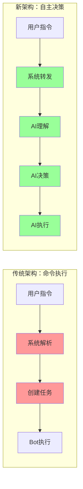
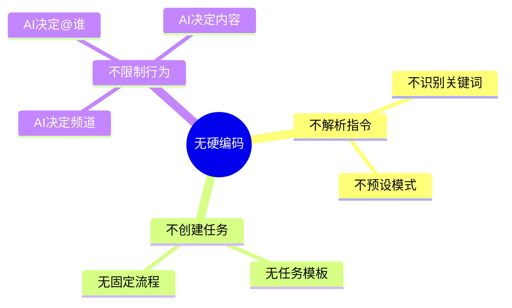
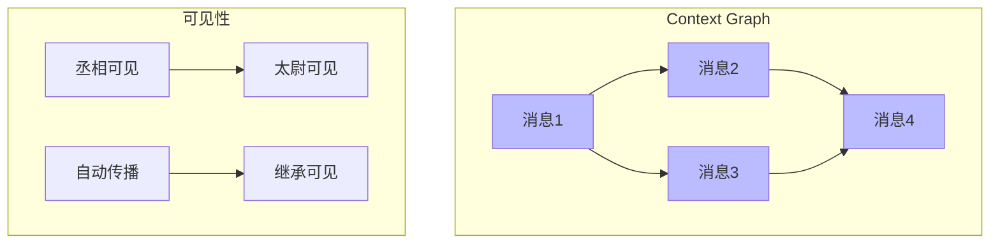
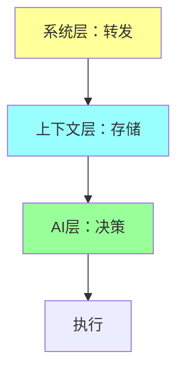

# AI-Toolbox 设计哲学

**版本**: 2.0  
**核心**: 自主决策架构

---

## 核心思想

### 从命令执行到自主协作



**转变**: 红色=硬编码限制，绿色=自主灵活

---

## 三大设计原则

### 1. 无硬编码



**为什么**: 让AI像人类一样自然理解和响应

### 2. 上下文感知



**机制**: 图结构存储 + 自动可见性传播

### 3. 配置驱动

```yaml
# 新增Bot只需配置，无需代码
bots:
  new_bot:
    name: "新角色"
    persona:
      description: "角色描述"
      # AI自主决策指南
      custom_instructions: |
        你可以...
```

---

## 系统思维

### 单一职责

| 组件 | 职责 | 边界 |
|------|------|------|
| **系统层** | 消息路由 | 不解析、不决策 |
| **上下文层** | 存储与提取 | 不干预决策 |
| **AI层** | 理解与决策 | 完全自主 |



---

## 设计价值

| 维度 | 传统方案 | 自主决策 |
|------|---------|----------|
| **灵活性** | 预设指令模式 | 任意自然语言 |
| **扩展性** | 改代码添加功能 | 配置即可 |
| **智能性** | 固定响应 | 自适应决策 |
| **维护性** | 硬编码难维护 | 配置化易维护 |

---

*设计哲学文档，指导架构演进*
