# AI-Toolbox 架构设计

## 设计哲学

> **能力解耦，灵活组合**

AI-Toolbox 的核心设计理念是将各个能力拆分为独立的模块，通过标准接口实现灵活组合，让用户可以像搭积木一样构建自定义 Agent。

---

## 系统架构

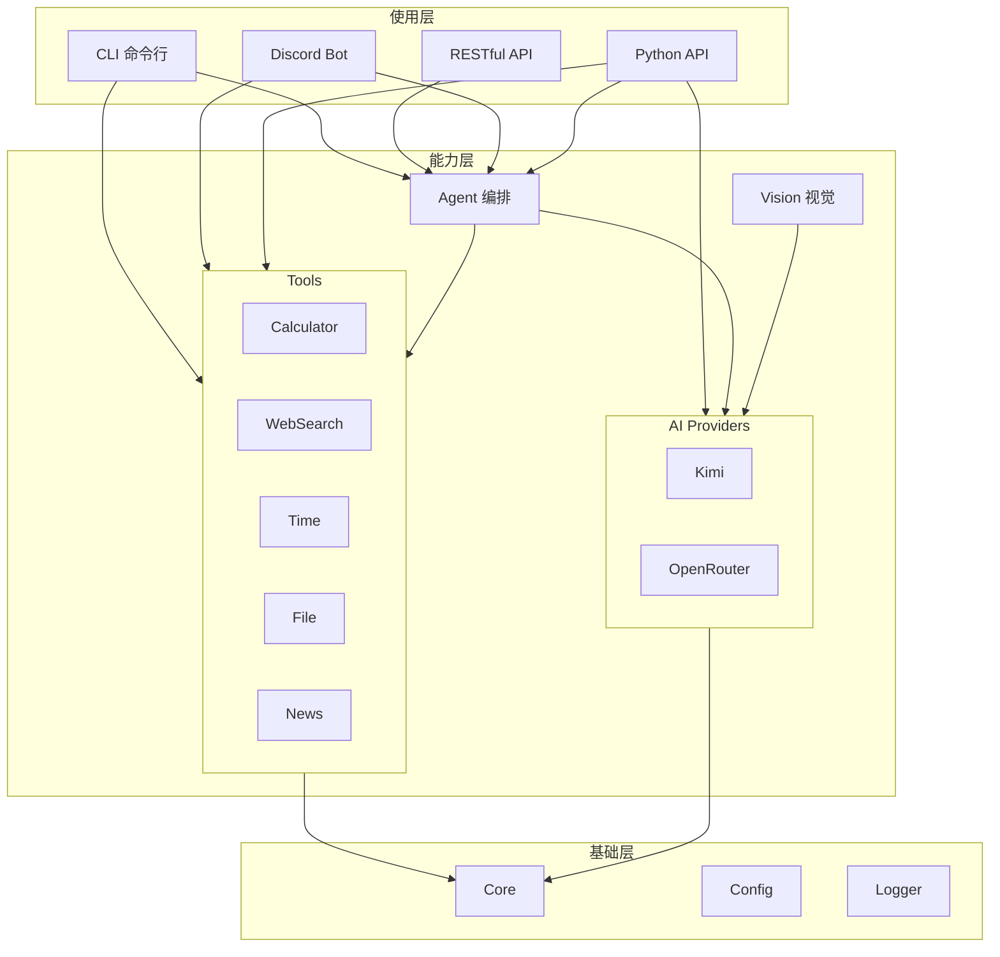

---

## 模块详解

### 1. 基础层 (Core)

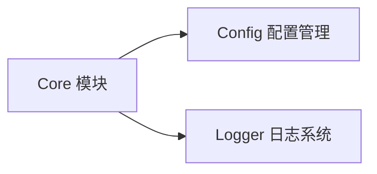

**职责**: 提供所有模块共享的基础设施

**设计原则**:
- 零依赖（除标准库外）
- 所有模块均可独立导入使用

### 2. 能力层 (Capabilities)

#### 2.1 Providers - AI 模型接入

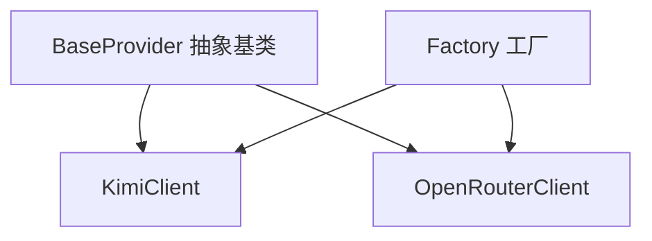

**特点**:
- 统一接口 `create_provider()`
- 自动格式转换（Anthropic/OpenAI）
- 支持文本 + 流式 + 多模态

#### 2.2 Tools - 工具能力

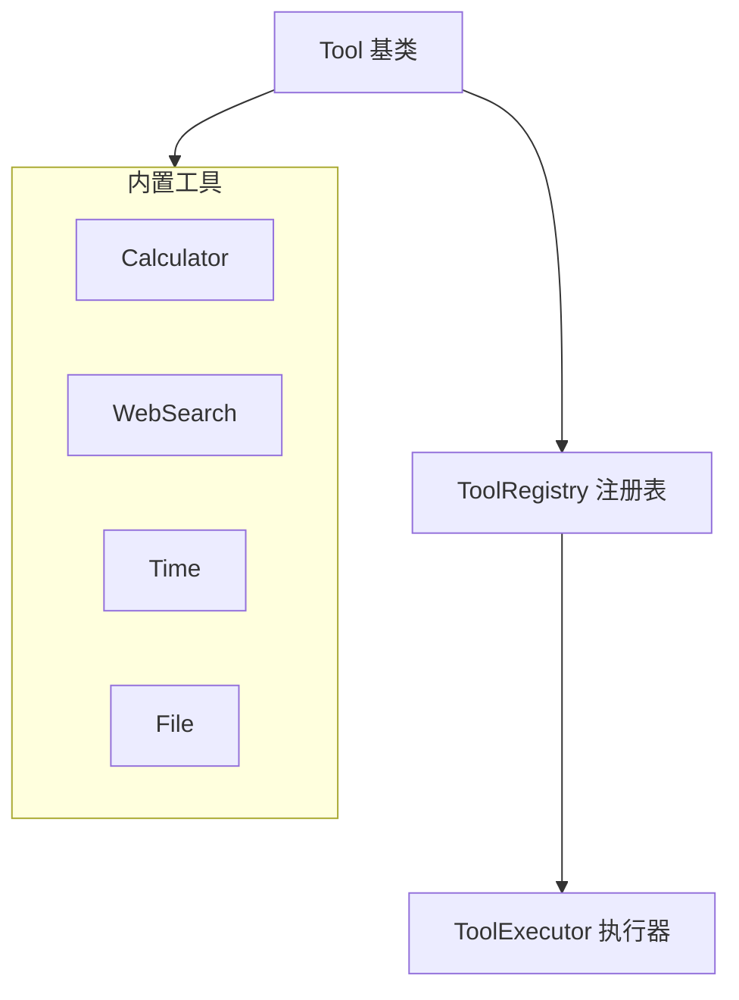

**特点**:
- 每个 Tool 独立实现
- 通过 Registry 动态注册
- Tool 之间无依赖
- 支持同步和异步

#### 2.3 Agent - 能力编排

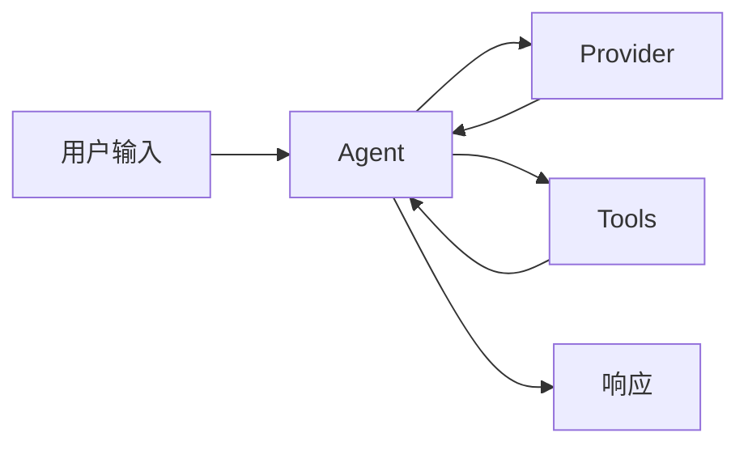

**工作流程**:
1. 接收用户输入
2. 调用 Provider 获取 AI 响应
3. 检测是否需要工具
4. 如需工具，调用 Executor 执行
5. 将结果返回给 AI
6. 返回最终响应

#### 2.4 Vision - 多模态支持

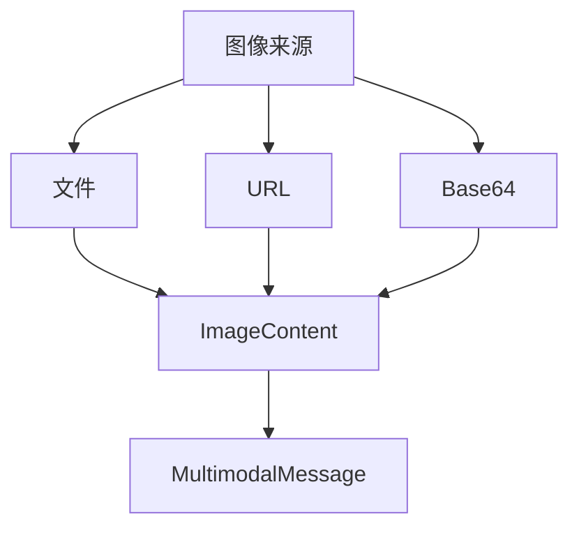

**支持格式**:
- JPEG, PNG, GIF, WebP
- 文件、URL、Base64

### 3. 使用层 (Interfaces)

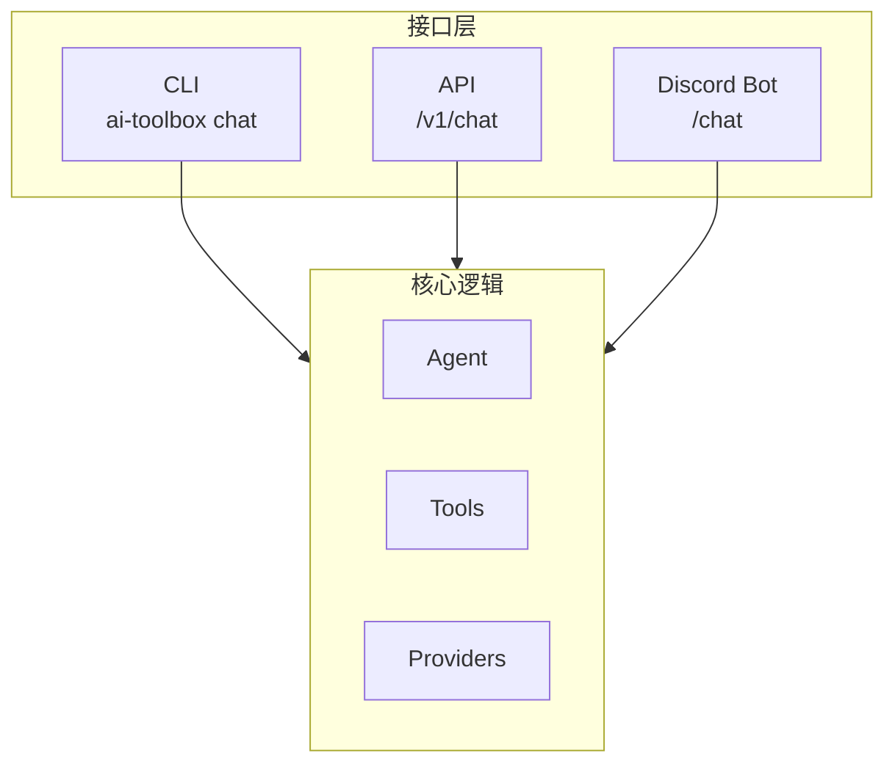

**特点**:
- 每个接口独立运行
- 可单独部署
- 共享能力层

---

## 数据流

### 工具调用流程

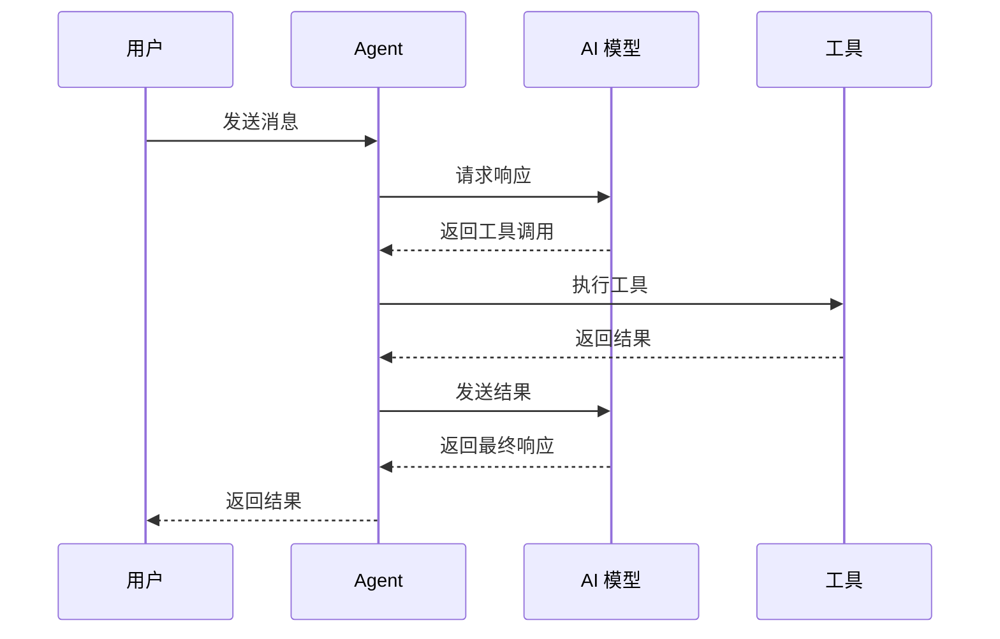

### Agent 频道模式

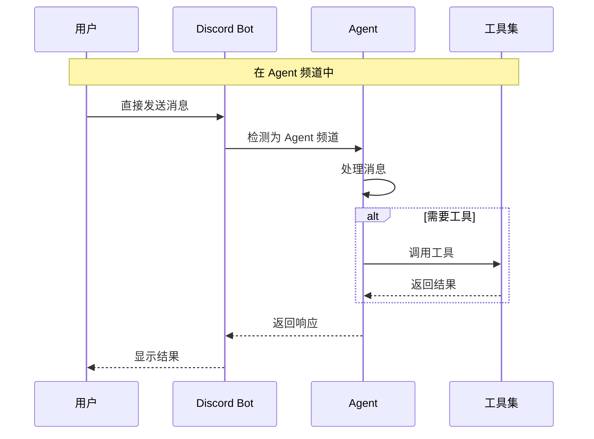

---

## 模块依赖关系

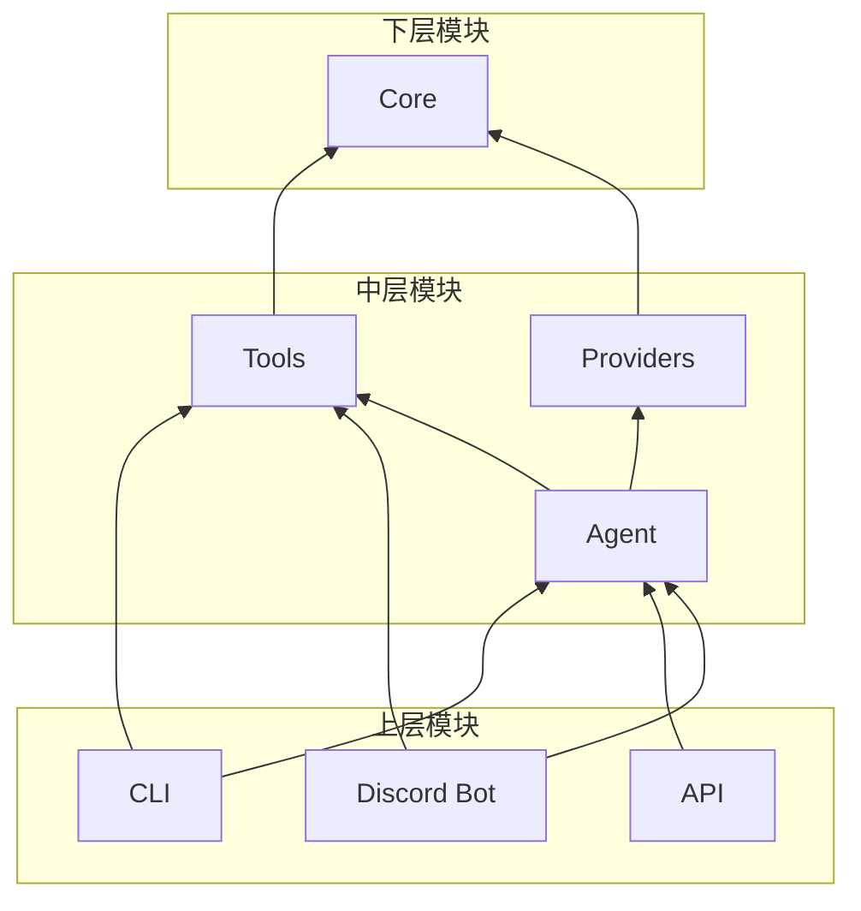

**依赖规则**:
1. Core 无依赖（最底层）
2. Providers/Tools 仅依赖 Core
3. Agent 依赖 Providers + Tools
4. 使用层依赖所有下层模块

---

## 扩展指南

### 添加新 Provider

```python
# src/ai_toolbox/providers/new_provider.py
from .base import BaseProvider, ChatMessage, ChatResponse

class NewProvider(BaseProvider):
    async def chat(self, messages, **kwargs) -> ChatResponse:
        # 实现
        pass
    
    async def stream_chat(self, messages, **kwargs):
        # 实现
        pass
    
    def list_models(self) -> list[str]:
        return ["model-1", "model-2"]

# 注册到 factory.py
PROVIDERS["new"] = NewProvider
```

### 添加新 Tool

```python
# 方式 1: 使用 Tool.from_function
from ai_toolbox.tools import Tool

def my_tool(param: str) -> str:
    return f"Result: {param}"

tool = Tool.from_function(
    my_tool,
    description="我的工具"
)

# 方式 2: 手动创建
from ai_toolbox.tools import Tool, ToolParameter

tool = Tool(
    name="my_tool",
    description="我的工具",
    parameters=[
        ToolParameter("param", "string", "参数")
    ],
    function=my_tool
)
```

### 自定义 Agent

```python
from ai_toolbox.agent import Agent

class CustomAgent(Agent):
    async def run(self, prompt: str) -> str:
        # 自定义逻辑
        # 可以使用 self.provider 和 self.tools
        pass
```

---

## 设计原则检查清单

实现新功能时，检查是否满足：

- [ ] **单一职责**: 每个模块只做一件事
- [ ] **接口隔离**: 通过抽象基类定义接口
- [ ] **依赖倒置**: 高层模块不依赖低层实现
- [ ] **可测试性**: 可以独立单元测试
- [ ] **可组合性**: 可以与其他模块自由组合
- [ ] **三种能力**: 支持 import / CLI / API

---

## 与 OpenClaw 的协作

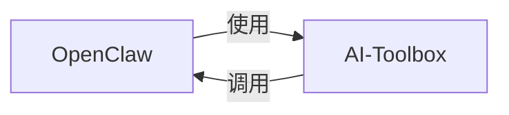

**互补定位**:
- **OpenClaw**: 系统级工具、环境控制、多模态输入
- **AI-Toolbox**: AI 模型统一管理、对外 API、工具编排

**协作模式**:
- OpenClaw 可以作为 AI-Toolbox 的消费者
- AI-Toolbox 可以将 OpenClaw 工具封装为 Tool

---

*最后更新: 2026-03-04*