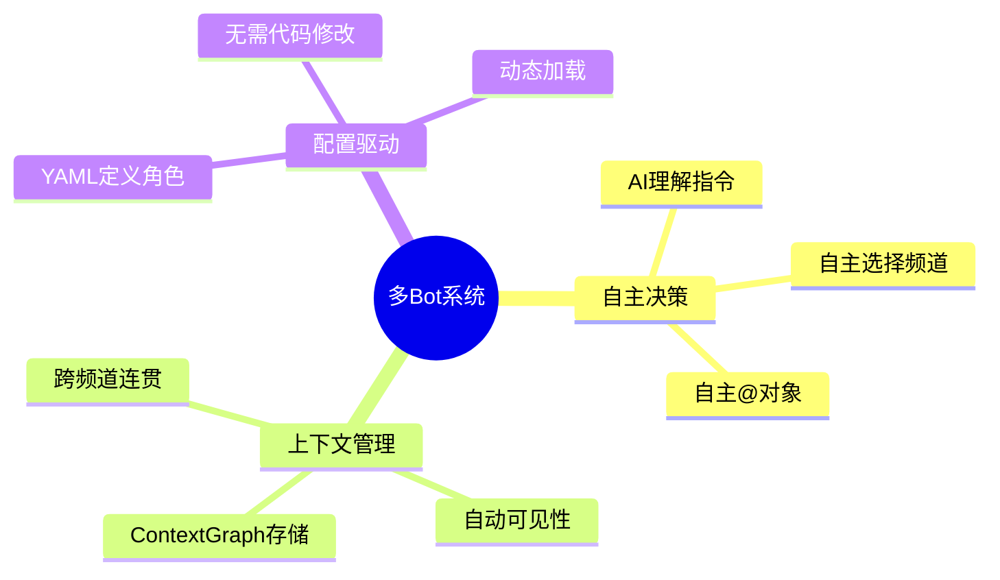

# 多 Bot 系统文档

**Multi-Bot System** - AI-Toolbox 核心组件

---

## 概述

多 Bot 系统是 AI-Toolbox 的核心，实现多个 AI Bot 在 Discord 中自主协作。

### 核心能力

---

## 模块文档

| 文档 | 内容 |
|------|------|
| [设计文档](design.md) | 架构设计详情 |
| [部署文档](deployment.md) | 部署和配置 |
| [测试文档](testing.md) | 测试用例和方法 |
| [调试文档](debug.md) | 问题排查 |

---

## 快速链接

- **配置示例**: `config/multi_bot.yaml`
- **脚本**: `scripts/multi_bot.sh`
- **源代码**: `src/ai_toolbox/multi_bot/`

---

*Multi-Bot System 文档*
