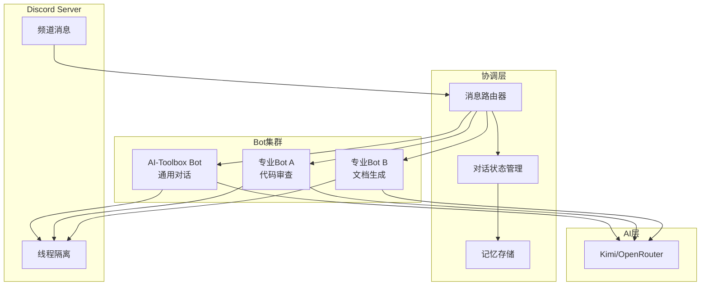

# 多Bot持续对话调研报告与重构方案

## 一、业内多Agent/Bot实现方案调研

### 1. Claude Code Agent Teams (Anthropic)

**核心架构：**
- **团队负责人 (Team Lead)**：协调工作、分配任务、综合结果
- **队友 (Teammates)**：独立工作，各自拥有独立的 context window
- **直接通信**：队友之间可以直接相互通信，无需通过负责人

**关键特性：**
- 共享任务列表 (Shared Task List)
- 认领工作模式
- 并行探索能增加真实价值的任务
- 适合：研究审查、新功能开发、跨层协调

**与Subagents的区别：**
| 特性 | Subagents | Agent Teams |
|------|-----------|-------------|
| 通信 | 只向主代理报告 | 队友直接相互通信 |
| 协调 | 主代理控制 | 共享任务列表 |
| 适用场景 | 顺序任务 | 并行独立任务 |

### 2. OpenAI Codex Multi-Agent

**核心架构：**
- **并行代理**：生成多个专业代理并行工作
- **结果汇总**：在一个响应中收集所有结果
- **编排管理**：自动处理代理生成、路由指令、等待结果

**关键特性：**
- 可定义不同配置的代理（不同模型、不同指令）
- 自动决定何时生成新代理
- 支持显式指定生成代理
- 支持长期运行的监控角色 (monitor role)

**工作流程：**
```
用户请求 -> 主代理分析 -> 生成多个专业代理 -> 并行执行 -> 汇总结果
```

### 3. Discord 多Bot交互模式

**常见模式：**

#### 模式A：中心化协调
```
用户 -> 协调Bot -> 分发给专业Bot -> 汇总回复
```

#### 模式B：去中心化对话
```
Bot A <-> Bot B <-> Bot C (通过共享频道/消息)
每个Bot独立监听，选择性回复
```

#### 模式C：线程隔离
```
主频道 -> 创建线程 -> 不同Bot在各自线程中工作
```

---

## 二、OpenClaw 模型与 Discord 交互分析

### OpenClaw 当前架构

**配置层级：**
```
agents/
├── main/
│   ├── agent/
│   │   ├── models.json          # 模型配置 (Kimi/OpenRouter)
│   │   ├── auth-profiles.json   # 认证配置
│   │   └── agent.json           # 代理元数据
│   └── config/                  # 运行时配置
```

**OpenClaw 与 Discord 交互方式：**

1. **Gateway 连接**：通过 Discord Gateway 接收所有消息
2. **消息路由**：根据 `message.mentions` 和频道配置决定是否响应
3. **Context 管理**：每个对话有独立的 session，携带历史记录
4. **模型调用**：通过 `sessions_spawn` 或 `subagents` 生成子代理处理复杂任务

**关键机制：**
- `heartbeat`：定期轮询检查任务
- `memory_search`：语义搜索历史记忆
- `sessions_send`：跨session消息传递

---

## 三、AI-Toolbox Discord Bot 重构方案

### 目标
实现多Bot（包括人类）在 Discord 中的持续对话，支持：
1. 多Bot并行响应
2. Bot之间的协作与对话
3. 对话状态持久化
4. 智能路由（决定哪个Bot响应）

### 架构设计



### 核心模块设计

#### 1. 消息路由器 (MessageRouter)

```python
class MessageRouter:
    """消息路由器 - 决定哪个Bot响应."""
    
    def __init__(self):
        self.bots: dict[str, BaseBot] = {}
        self.routing_rules: list[RoutingRule] = []
    
    async def route(self, message: discord.Message) -> list[BaseBot]:
        """根据消息内容决定哪些Bot应该响应."""
        # 1. 分析消息意图
        intent = await self.analyze_intent(message)
        
        # 2. 匹配路由规则
        matched_bots = []
        for rule in self.routing_rules:
            if rule.matches(intent, message):
                matched_bots.append(self.bots[rule.bot_id])
        
        # 3. 如果没有匹配，使用默认Bot
        if not matched_bots:
            matched_bots = [self.bots.get("default")]
        
        return matched_bots
```

#### 2. 对话状态管理 (ConversationState)

```python
@dataclass
class ConversationMessage:
    """对话消息."""
    id: str
    author: str  # Bot ID 或用户ID
    content: str
    timestamp: datetime
    reply_to: str | None = None  # 回复哪条消息


class ConversationState:
    """对话状态管理."""
    
    def __init__(self, channel_id: str):
        self.channel_id = channel_id
        self.messages: list[ConversationMessage] = []
        self.participants: set[str] = set()  # 参与的Bot和用户
        self.context_window: int = 10  # 保留最近10条消息
    
    async def add_message(self, msg: ConversationMessage):
        """添加消息到对话历史."""
        self.messages.append(msg)
        self.participants.add(msg.author)
        
        # 保持窗口大小
        if len(self.messages) > self.context_window:
            self.messages = self.messages[-self.context_window:]
    
    def get_context(self, for_bot: str) -> list[ConversationMessage]:
        """获取指定Bot的对话上下文."""
        return [
            msg for msg in self.messages
            if msg.author != for_bot or msg.reply_to  # 排除自己的消息，保留回复
        ]
```

#### 3. 多Bot协调器 (MultiBotOrchestrator)

```python
class MultiBotOrchestrator:
    """多Bot协调器 - 类似 Claude Agent Teams."""
    
    def __init__(self):
        self.router = MessageRouter()
        self.states: dict[str, ConversationState] = {}  # channel_id -> state
        self.bots: dict[str, DiscordBot] = {}
    
    async def handle_message(self, message: discord.Message):
        """处理频道消息."""
        channel_id = str(message.channel.id)
        
        # 获取或创建对话状态
        if channel_id not in self.states:
            self.states[channel_id] = ConversationState(channel_id)
        
        state = self.states[channel_id]
        
        # 添加消息到对话
        conv_msg = ConversationMessage(
            id=str(message.id),
            author=str(message.author.id),
            content=message.content,
            timestamp=message.created_at
        )
        await state.add_message(conv_msg)
        
        # 路由消息到合适的Bots
        target_bots = await self.router.route(message)
        
        # 并行调用Bots
        tasks = [
            self.invoke_bot(bot, message, state)
            for bot in target_bots
        ]
        responses = await asyncio.gather(*tasks, return_exceptions=True)
        
        # 处理响应
        for bot, response in zip(target_bots, responses):
            if isinstance(response, Exception):
                logger.error(f"Bot {bot.id} failed: {response}")
            else:
                # 发送响应到Discord
                await self.send_response(bot, message.channel, response)
                
                # 记录到对话状态
                bot_msg = ConversationMessage(
                    id=str(uuid.uuid4()),
                    author=bot.id,
                    content=response,
                    timestamp=datetime.now(),
                    reply_to=conv_msg.id
                )
                await state.add_message(bot_msg)
    
    async def invoke_bot(
        self, 
        bot: DiscordBot, 
        message: discord.Message,
        state: ConversationState
    ) -> str:
        """调用单个Bot处理消息."""
        # 获取对话上下文
        context = state.get_context(for_bot=bot.id)
        
        # 构建提示
        prompt = self.build_prompt(message, context, bot.persona)
        
        # 调用Bot处理
        response = await bot.process(prompt)
        
        return response
```

#### 4. Bot角色定义 (BotPersona)

```python
@dataclass
class BotPersona:
    """Bot角色定义."""
    id: str
    name: str
    description: str
    system_prompt: str
    triggers: list[str]  # 触发词
    model: str = "kimi"
    temperature: float = 0.7


# 预定义角色
PERSONAS = {
    "general": BotPersona(
        id="general",
        name="通用助手",
        description="处理一般性问题",
        system_prompt="你是一个 helpful 的AI助手...",
        triggers=["帮助", "问题", "怎么"]
    ),
    "coder": BotPersona(
        id="coder",
        name="代码专家",
        description="专门处理代码相关问题",
        system_prompt="你是一个专业的程序员...",
        triggers=["代码", "bug", "python", "错误"]
    ),
    "reviewer": BotPersona(
        id="reviewer",
        name="审查员",
        description="审查代码和文档",
        system_prompt="你是一个严格的代码审查员...",
        triggers=["审查", "review", "检查"]
    )
}
```

### 与 OpenClaw 的集成方案

#### 方案A：OpenClaw 作为主协调器

```python
# 在 OpenClaw 中调用 ai-toolbox
from ai_toolbox.orchestrator import MultiBotOrchestrator

# OpenClaw 收到 Discord 消息后
async def on_discord_message(message):
    # 使用 ai-toolbox 的 orchestrator 处理
    orchestrator = MultiBotOrchestrator()
    await orchestrator.handle_message(message)
```

#### 方案B：独立运行，通过 API 通信

```python
# ai-toolbox 作为独立服务运行
# OpenClaw 通过 REST API 调用

# OpenClaw side
async def handle_message(message):
    response = await http.post(
        "http://localhost:8000/v1/discord/route",
        json={"message": message.content}
    )
    # 转发响应到 Discord
```

### 关键技术决策

| 决策项 | 选择 | 理由 |
|--------|------|------|
| 协调模式 | 去中心化 + 路由 | 灵活，支持复杂对话 |
| 状态存储 | 内存 + 可选Redis | 简单场景内存足够，复杂场景可扩展 |
| Bot识别 | @提及 + 触发词 | 兼容人类@Bot的习惯 |
| 上下文窗口 | 滑动窗口 (10-20条) | 平衡成本和效果 |
| 并行处理 | asyncio.gather | Python原生支持 |

### 实施路线图

#### Phase 1: 基础架构 (1-2天)
1. 实现 `MessageRouter` 基础路由
2. 实现 `ConversationState` 状态管理
3. 单Bot响应验证

#### Phase 2: 多Bot支持 (2-3天)
1. 实现 `MultiBotOrchestrator`
2. 添加多Bot并行响应
3. Bot间消息传递

#### Phase 3: 高级功能 (3-5天)
1. 智能路由（基于内容分析）
2. 持久化存储（Redis/SQLite）
3. 线程隔离支持

#### Phase 4: 集成优化 (2天)
1. 与 OpenClaw 集成测试
2. 性能优化
3. 文档完善

---

## 四、参考实现代码框架

```python
# ai_toolbox/discord_bot/multi_bot.py

import discord
from discord.ext import commands
import asyncio
from dataclasses import dataclass, field
from typing import Optional, List, Dict
from datetime import datetime
import uuid


@dataclass
class BotMessage:
    """标准化消息格式."""
    id: str
    author_id: str
    author_name: str
    content: str
    timestamp: datetime
    channel_id: str
    reply_to: Optional[str] = None
    mentions: List[str] = field(default_factory=list)


class MultiBotConversation:
    """多Bot对话管理器."""
    
    def __init__(self, channel_id: str, max_history: int = 20):
        self.channel_id = channel_id
        self.max_history = max_history
        self.messages: List[BotMessage] = []
        self.bots: Dict[str, 'BotInstance'] = {}
        self.is_active = True
    
    async def add_message(self, msg: BotMessage):
        """添加消息到对话."""
        self.messages.append(msg)
        
        # 保持历史记录长度
        if len(self.messages) > self.max_history:
            self.messages = self.messages[-self.max_history:]
    
    def get_formatted_history(self) -> str:
        """获取格式化的对话历史."""
        formatted = []
        for msg in self.messages:
            prefix = f"[{msg.author_name}]"
            if msg.reply_to:
                prefix += f" (回复)"
            formatted.append(f"{prefix}: {msg.content}")
        return "\n".join(formatted)


class BotInstance:
    """Bot实例."""
    
    def __init__(self, bot_id: str, name: str, system_prompt: str):
        self.id = bot_id
        self.name = name
        self.system_prompt = system_prompt
        self.is_active = True
    
    async def should_respond(self, message: BotMessage, history: str) -> bool:
        """判断是否应该响应此消息."""
        # 被@时一定响应
        if self.id in message.mentions:
            return True
        
        # 根据触发词判断
        # TODO: 使用AI判断意图
        return False
    
    async def generate_response(
        self, 
        message: BotMessage, 
        history: str,
        client  # AI provider client
    ) -> Optional[str]:
        """生成响应."""
        # 构建提示
        prompt = f"""{self.system_prompt}

对话历史:
{history}

当前消息来自 {message.author_name}: {message.content}

请回复:"""
        
        # 调用AI生成响应
        from ai_toolbox.providers import ChatMessage
        messages = [
            ChatMessage(role="system", content=self.system_prompt),
            ChatMessage(role="user", content=f"历史:\n{history}\n\n当前: {message.content}")
        ]
        
        response = await client.chat(messages)
        return response.content


class MultiBotDiscordClient(commands.Bot):
    """多Bot Discord客户端."""
    
    def __init__(self):
        super().__init__(
            command_prefix="!",
            intents=discord.Intents.all()
        )
        self.conversations: Dict[str, MultiBotConversation] = {}
        self.bots: Dict[str, BotInstance] = {}
        self.ai_client = None  # AI provider
    
    async def setup_hook(self):
        """初始化."""
        # 注册Bots
        self.bots["general"] = BotInstance(
            "general", 
            "通用助手", 
            "你是一个 helpful 的AI助手"
        )
        self.bots["coder"] = BotInstance(
            "coder", 
            "代码专家", 
            "你是一个专业的程序员"
        )
        
        # 初始化AI客户端
        from ai_toolbox import create_provider
        self.ai_client = create_provider("kimi", api_key="...")
    
    async def on_message(self, message: discord.Message):
        """处理消息."""
        # 忽略自己
        if message.author == self.user:
            return
        
        # 获取或创建对话
        channel_id = str(message.channel.id)
        if channel_id not in self.conversations:
            self.conversations[channel_id] = MultiBotConversation(channel_id)
        
        conv = self.conversations[channel_id]
        
        # 转换为标准消息格式
        bot_msg = BotMessage(
            id=str(message.id),
            author_id=str(message.author.id),
            author_name=message.author.display_name,
            content=message.content,
            timestamp=message.created_at,
            channel_id=channel_id,
            mentions=[str(m.id) for m in message.mentions]
        )
        
        await conv.add_message(bot_msg)
        
        # 决定哪些Bot响应
        history = conv.get_formatted_history()
        responding_bots = []
        
        for bot in self.bots.values():
            if await bot.should_respond(bot_msg, history):
                responding_bots.append(bot)
        
        # 并行生成响应
        if responding_bots:
            tasks = [
                self.generate_bot_response(bot, bot_msg, history, conv)
                for bot in responding_bots
            ]
            await asyncio.gather(*tasks, return_exceptions=True)
    
    async def generate_bot_response(
        self, 
        bot: BotInstance, 
        message: BotMessage,
        history: str,
        conv: MultiBotConversation
    ):
        """生成并发送Bot响应."""
        response = await bot.generate_response(message, history, self.ai_client)
        
        if response:
            # 发送到Discord
            channel = self.get_channel(int(conv.channel_id))
            if channel:
                sent_msg = await channel.send(f"**{bot.name}**: {response}")
                
                # 记录到对话
                bot_message = BotMessage(
                    id=str(sent_msg.id),
                    author_id=bot.id,
                    author_name=bot.name,
                    content=response,
                    timestamp=datetime.now(),
                    channel_id=conv.channel_id,
                    reply_to=message.id
                )
                await conv.add_message(bot_message)
```

---

## 五、总结

### 核心洞察

1. **Claude Agent Teams** 适合复杂任务分解，强调Bot间直接通信
2. **OpenAI Codex** 适合并行探索，自动编排代理
3. **Discord 多Bot** 最适合去中心化 + 智能路由模式

### 推荐方案

采用 **"智能路由 + 对话状态管理 + 并行响应"** 架构：
- 一个协调层负责消息分发
- 每个Bot独立工作，有独立人格
- 共享对话历史，支持上下文理解
- 支持人机混合对话

### 与 ai-toolbox 的整合

1. 在 `discord_bot` 模块中添加 `multi_bot.py`
2. 复用现有的 `providers` 模块进行AI调用
3. 可选集成 `executor` 模块执行代码
4. 可选集成 `web_search` 获取实时信息

这样，ai-toolbox 将不仅是一个AI工具箱，更是一个**多Agent协作平台**！