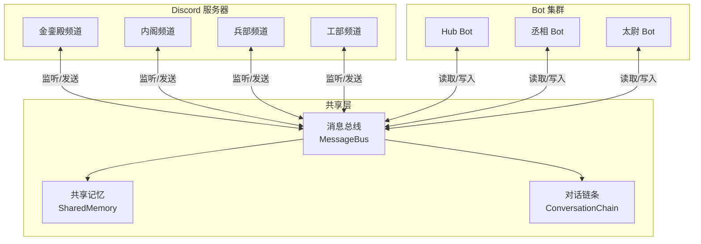

# 多 Bot 持续对话 - 重新设计方案

## 需求分析

基于陛下要求：
1. **多身份参与**: 丞相、太尉、Hub 等不同 Bot 身份
2. **实时共享**: 所有 Bot 和人类消息跨频道实时同步
3. **相互 @**: Bot 之间可以相互提及，形成对话链条

## 核心架构



## 关键组件

### 1. 消息总线 (MessageBus)

```python
class MessageBus:
    """中央消息总线 - 所有消息通过这里中转"""
    
    def __init__(self):
        self.subscribers: dict[str, list[Callable]] = {}
        self.message_history: list[UnifiedMessage] = []
        self.max_history = 100
    
    async def publish(self, message: UnifiedMessage):
        """发布消息到总线"""
        # 存储到历史
        self.message_history.append(message)
        if len(self.message_history) > self.max_history:
            self.message_history = self.message_history[-self.max_history:]
        
        # 广播给所有订阅者
        for subscriber in self.subscribers.get("*", []):
            await subscriber(message)
    
    def subscribe(self, callback: Callable, channel: str = "*"):
        """订阅消息"""
        if channel not in self.subscribers:
            self.subscribers[channel] = []
        self.subscribers[channel].append(callback)
```

### 2. 统一消息格式 (UnifiedMessage)

```python
@dataclass
class UnifiedMessage:
    """统一消息格式 - 跨所有频道和 Bot"""
    id: str
    author_id: str           # Discord User ID
    author_name: str         # 显示名称
    author_type: str         # "human", "hub", "chengxiang", "taiwei"
    content: str
    channel_id: str          # 来源频道
    channel_name: str        # 频道名称
    timestamp: datetime
    mentions: list[str]      # @的 Bot ID 列表
    reply_to: str | None     # 回复的消息 ID
    metadata: dict           # 额外信息
```

### 3. 多 Bot 协调器 (MultiBotCoordinator)

```python
class MultiBotCoordinator:
    """多 Bot 协调器 - 管理所有 Bot 实例"""
    
    def __init__(self):
        self.bots: dict[str, BotInstance] = {}
        self.message_bus = MessageBus()
        self.shared_memory = SharedMemory()
        
    def register_bot(self, bot_id: str, token: str, persona: BotPersona):
        """注册 Bot"""
        self.bots[bot_id] = BotInstance(
            bot_id=bot_id,
            token=token,
            persona=persona,
            bus=self.message_bus
        )
    
    async def start(self):
        """启动所有 Bot"""
        # 所有 Bot 同时连接 Discord
        await asyncio.gather(
            *[bot.start() for bot in self.bots.values()]
        )
```

### 4. Bot 实例 (BotInstance)

```python
class BotInstance:
    """单个 Bot 实例"""
    
    def __init__(self, bot_id: str, token: str, persona: BotPersona, bus: MessageBus):
        self.bot_id = bot_id
        self.token = token
        self.persona = persona
        self.bus = bus
        self.client: discord.Client | None = None
        
    async def start(self):
        """启动 Bot"""
        self.client = discord.Client(intents=discord.Intents.all())
        
        @self.client.event
        async def on_message(message):
            await self.handle_message(message)
        
        # 订阅总线消息（其他 Bot/频道的消息）
        self.bus.subscribe(self.on_bus_message)
        
        await self.client.start(self.token)
    
    async def handle_message(self, message: discord.Message):
        """处理 Discord 消息"""
        # 忽略自己
        if message.author.id == self.client.user.id:
            return
        
        # 转换为统一消息
        unified = self.to_unified_message(message)
        
        # 发布到总线
        await self.bus.publish(unified)
        
        # 决定是否响应
        if self.should_respond(unified):
            await self.generate_response(unified)
    
    async def on_bus_message(self, message: UnifiedMessage):
        """处理总线消息（来自其他频道/Bot）"""
        # 如果消息提到了我
        if self.bot_id in message.mentions:
            await self.generate_response(message)
        
        # 或者根据上下文判断是否需要参与
        elif self.should_join_conversation(message):
            await self.generate_response(message)
    
    def should_respond(self, message: UnifiedMessage) -> bool:
        """是否应该响应"""
        # 被直接 @
        if self.bot_id in message.mentions:
            return True
        
        # 被角色 @
        if f"@{self.persona.role}" in message.content:
            return True
        
        # 根据对话上下文判断
        recent = self.bus.get_recent_messages(5)
        if self.is_addressed_in_context(recent):
            return True
        
        return False
    
    async def generate_response(self, message: UnifiedMessage):
        """生成响应"""
        # 构建上下文（包含所有 Bot 和人类的最近对话）
        context = self.build_context()
        
        # 调用 AI
        prompt = f"""{self.persona.system_prompt}

当前对话上下文：
{context}

{message.author_name} 说：{message.content}

请作为{self.persona.name}回复："""
        
        response = await self.call_ai(prompt)
        
        # 发送回 Discord
        channel = self.client.get_channel(int(message.channel_id))
        if channel:
            sent = await channel.send(
                f"{message.author_name} {self.format_mention(message)}\n{response}"
            )
            
            # 发布到总线
            unified_response = UnifiedMessage(
                id=str(sent.id),
                author_id=self.bot_id,
                author_name=self.persona.name,
                author_type=self.bot_id,
                content=response,
                channel_id=message.channel_id,
                channel_name=message.channel_name,
                timestamp=datetime.now(),
                mentions=self.extract_mentions(response),
                reply_to=message.id,
                metadata={}
            )
            await self.bus.publish(unified_response)
```

### 5. 共享记忆 (SharedMemory)

```python
class SharedMemory:
    """共享记忆 - 所有 Bot 共享的长期记忆"""
    
    def __init__(self):
        self.conversations: dict[str, Conversation] = {}
        self.facts: dict[str, str] = {}  # 提取的事实
        self.relationships: dict[str, dict] = {}  # Bot 间关系
    
    def store_conversation(self, thread_id: str, messages: list):
        """存储对话"""
        self.conversations[thread_id] = {
            "messages": messages,
            "last_updated": datetime.now()
        }
    
    def get_context(self, thread_id: str, limit: int = 20) -> str:
        """获取对话上下文"""
        conv = self.conversations.get(thread_id, {})
        messages = conv.get("messages", [])[-limit:]
        return self.format_context(messages)
```

## 对话链条机制

```python
class ConversationChain:
    """对话链条 - 追踪多轮对话"""
    
    def __init__(self):
        self.chains: dict[str, list[str]] = {}  # thread_id -> message_ids
    
    def add_to_chain(self, reply_to: str | None, message_id: str):
        """添加到链条"""
        if reply_to:
            # 找到链条并追加
            for thread_id, chain in self.chains.items():
                if reply_to in chain:
                    chain.append(message_id)
                    return thread_id
        
        # 新开链条
        new_thread = str(uuid.uuid4())
        self.chains[new_thread] = [message_id]
        return new_thread
    
    def get_chain(self, message_id: str) -> list[str]:
        """获取完整对话链条"""
        for chain in self.chains.values():
            if message_id in chain:
                return chain
        return []
```

## Bot 身份配置

```python
# 赛博王朝 Bot 配置
DYNASTY_BOTS = {
    "hub": {
        "token": "YOUR_HUB_BOT_TOKEN",  # 从环境变量或配置文件读取
        "name": "Hub",
        "role": "协调者",
        "system_prompt": "你是赛博王朝的Hub，负责协调各Bot之间的通信...",
        "channels": ["*"]  # 监听所有频道
    },
    "chengxiang": {
        "token": "YOUR_CHENGXIANG_BOT_TOKEN",  # 从环境变量或配置文件读取
        "name": "丞相",
        "role": "丞相",
        "system_prompt": "你是赛博王朝的丞相，三公之首，统筹决策...",
        "channels": ["金銮殿", "内阁"]
    },
    "taiwei": {
        "token": "YOUR_TAIWEI_BOT_TOKEN",  # 从环境变量或配置文件读取
        "name": "太尉",
        "role": "太尉",
        "system_prompt": "你是赛博王朝的太尉，负责安全和执行...",
        "channels": ["兵部", "都察院"]
    }
}
```

**Token 配置方式**:
```bash
export HUB_BOT_TOKEN="your_token"
export CHENGXIANG_BOT_TOKEN="your_token"
export TAIWEI_BOT_TOKEN="your_token"
```

## 使用示例

```python
async def main():
    # 创建协调器
    coordinator = MultiBotCoordinator()
    
    # 注册赛博王朝 Bot
    for bot_id, config in DYNASTY_BOTS.items():
        coordinator.register_bot(
            bot_id=bot_id,
            token=config["token"],
            persona=BotPersona(
                name=config["name"],
                role=config["role"],
                system_prompt=config["system_prompt"]
            )
        )
    
    # 启动所有 Bot
    await coordinator.start()

# 对话示例：
# 人类 @皇帝: "丞相、太尉，你们觉得这个方案如何？"
# 
# 系统：
# 1. 消息进入总线
# 2. 丞相 Bot 检测到被 @，生成回复
# 3. 太尉 Bot 检测到被 @，生成回复
# 4. 两者回复都进入总线
# 5. 丞相 @太尉: "太尉觉得如何？"
# 6. 太尉回复丞相
# 7. 形成持续对话链条
```

## 技术要点

1. **并发连接**: 每个 Bot 独立的 Discord 连接
2. **消息去重**: 通过 message_id 避免循环
3. **上下文窗口**: 最近 20-50 条消息
4. **身份识别**: 通过 author_type 区分 Bot/人类
5. **@提及解析**: 支持 Discord 和自定义格式

## 实现优先级

1. **Phase 1** (2天): 消息总线 + 2个 Bot 基础对话
2. **Phase 2** (2天): 共享记忆 + 对话链条
3. **Phase 3** (2天): 3个 Bot 完整集成 + 跨频道
4. **Phase 4** (2天): 智能路由 + 优化

总计约 8 天完成完整功能。