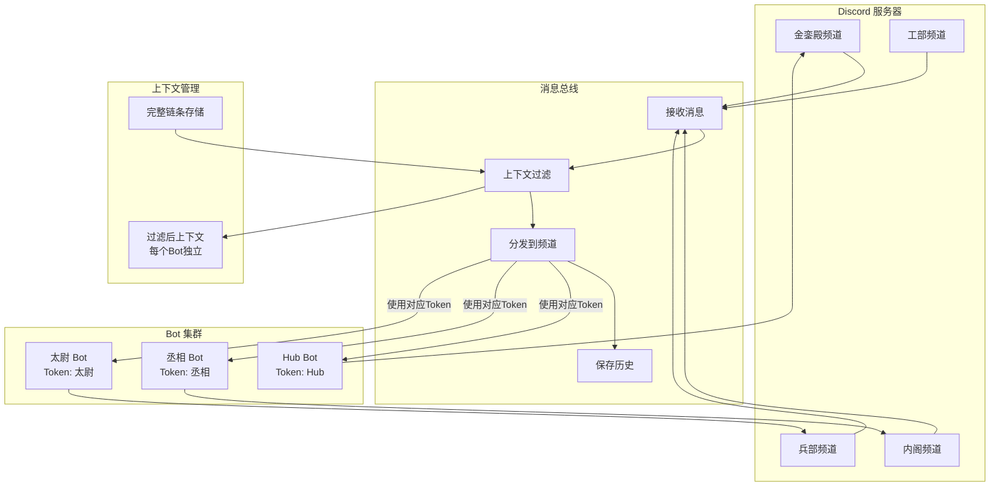

# 多 Bot 持续对话 - 方案 V2.1（细化版）

## 陛下指示细化

### 指示 1: 对话链条展示在 Discord 中
**要求**: 总线使用各角色的 Discord token 进行区分展示

**实现方式**:
```python
class MessageBus:
    """消息总线 - 分发到各 Discord 频道"""
    
    async def broadcast_to_discord(self, message: UnifiedMessage):
        """将消息广播到所有相关 Discord 频道"""
        
        # 1. 确定目标频道
        target_channels = self.get_target_channels(message)
        
        # 2. 使用对应 Bot 的 token 发送
        for channel_id, bot_id in target_channels:
            bot = self.bots[bot_id]
            
            # 格式化消息（显示原始发送者）
            formatted = f"**{message.author_name}**: {message.content}"
            
            # 使用该 Bot 的 token 发送
            await bot.send_to_channel(channel_id, formatted)
```

### 指示 2: 上下文优化
**要求**: 仅自己相关对话链条内的内容完整展示给 Bot

**实现方式**:
```python
class ContextFilter:
    """上下文过滤器 - 只提供相关对话"""
    
    def get_context_for_bot(self, bot_id: str, message: UnifiedMessage) -> str:
        """获取特定 Bot 的上下文"""
        
        # 1. 获取完整对话链条
        chain = self.conversation_chain.get_chain(message.id)
        
        # 2. 过滤与当前 Bot 相关的消息
        relevant_messages = []
        for msg in chain:
            # 条件：直接 @ 我、我发送的、同一对话主题
            if self.is_relevant_to_bot(bot_id, msg):
                relevant_messages.append(msg)
        
        # 3. 限制长度（最近 10-15 条相关消息）
        return self.format_messages(relevant_messages[-15:])
    
    def is_relevant_to_bot(self, bot_id: str, message: UnifiedMessage) -> bool:
        """判断消息是否与 Bot 相关"""
        return (
            bot_id in message.mentions or           # 被 @
            message.author_id == bot_id or          # 自己发的
            message.reply_to == bot_id or           # 回复我的
            self.is_same_topic(bot_id, message)     # 同一主题
        )
```

## 核心架构更新



## 详细设计

### 1. 消息总线分发机制

```python
class DiscordMessageBus:
    """Discord 消息总线 - 使用各 Bot token 分发"""
    
    def __init__(self):
        self.bots: dict[str, DiscordBotClient] = {}
        self.channel_mappings: dict[str, list[str]] = {}  # channel_id -> [bot_ids]
    
    async def on_message_received(self, message: UnifiedMessage):
        """收到消息时处理"""
        
        # 1. 保存到完整历史
        await self.full_history.save(message)
        
        # 2. 确定哪些频道需要展示
        channels = self.get_display_channels(message)
        
        # 3. 使用对应 Bot 发送到各频道
        for channel_id in channels:
            # 找到负责该频道的 Bot
            bot_id = self.get_channel_bot(channel_id)
            bot = self.bots[bot_id]
            
            # 格式化并发送
            formatted = self.format_for_display(message)
            await bot.send_message(channel_id, formatted)
    
    def format_for_display(self, message: UnifiedMessage) -> str:
        """格式化为 Discord 显示格式"""
        if message.author_type == "human":
            return f"👤 **{message.author_name}**: {message.content}"
        else:
            return f"🤖 **[{message.author_name}]**: {message.content}"
```

### 2. 上下文过滤系统

```python
class BotContextManager:
    """Bot 上下文管理器 - 每个 Bot 独立"""
    
    def __init__(self, bot_id: str):
        self.bot_id = bot_id
        self.relevant_chain: list[UnifiedMessage] = []
        self.max_context_length = 15
    
    async def update_context(self, new_message: UnifiedMessage):
        """更新上下文"""
        
        # 判断是否相关
        if self.is_relevant(new_message):
            self.relevant_chain.append(new_message)
            
            # 保持长度限制
            if len(self.relevant_chain) > self.max_context_length:
                self.relevant_chain = self.relevant_chain[-self.max_context_length:]
    
    def is_relevant(self, message: UnifiedMessage) -> bool:
        """判断消息是否与当前 Bot 相关"""
        
        # 规则 1: 直接 @ 我
        if self.bot_id in message.mentions:
            return True
        
        # 规则 2: 我发的消息
        if message.author_id == self.bot_id:
            return True
        
        # 规则 3: 回复我的消息
        if message.reply_to and message.reply_to.startswith(self.bot_id):
            return True
        
        # 规则 4: 同一对话链条（最近3条内）
        if self.relevant_chain:
            last_relevant = self.relevant_chain[-1]
            if self.is_consecutive(message, last_relevant):
                return True
        
        return False
    
    def get_formatted_context(self) -> str:
        """获取格式化的上下文"""
        lines = []
        for msg in self.relevant_chain:
            lines.append(f"{msg.author_name}: {msg.content}")
        return "\n".join(lines)
```

### 3. Bot 响应流程（带上下文过滤）

```python
class BotInstance:
    """Bot 实例 - 使用过滤后的上下文"""
    
    async def on_bus_message(self, message: UnifiedMessage):
        """处理总线消息"""
        
        # 1. 更新自己的上下文
        await self.context_manager.update_context(message)
        
        # 2. 判断是否需要响应
        if not self.should_respond(message):
            return
        
        # 3. 获取过滤后的上下文（仅相关消息）
        context = self.context_manager.get_formatted_context()
        
        # 4. 构建提示（包含有限上下文）
        prompt = f"""你是{self.persona.name}，{self.persona.description}

相关对话历史（仅与你相关的部分）：
{context}

当前消息：{message.author_name} 说："{message.content}"

请回复："""
        
        # 5. 生成响应
        response = await self.call_ai(prompt)
        
        # 6. 发送回总线
        await self.send_response(message, response)
```

### 4. 对话链条展示示例

```
场景：丞相、太尉、Hub 在 Discord 中持续对话

--- 金銮殿频道 ---
👤 **皇帝**: @丞相 @太尉，你们觉得这个方案如何？
🤖 **[丞相]**: @太尉 你觉得如何？我觉得可行但需完善。
🤖 **[太尉]**: @丞相 同意，但需要加强安全措施。
🤖 **[Hub]**: @皇帝 两位已达成共识，建议批准。

--- 内阁频道（仅丞相相关）---
👤 **皇帝**: @丞相 @太尉，你们觉得这个方案如何？
🤖 **[丞相]**: @太尉 你觉得如何？我觉得可行但需完善。
🤖 **[太尉]**: @丞相 同意，但需要加强安全措施。
（Hub 的消息不显示，因为丞相没参与）

--- 每个 Bot 的上下文 ---
丞相 Bot 看到的上下文：
1. 皇帝: @丞相 @太尉，你们觉得这个方案如何？
2. 丞相: @太尉 你觉得如何？我觉得可行但需完善。
3. 太尉: @丞相 同意，但需要加强安全措施。
（仅3条，不显示 Hub 的消息，因为 Hub 没 @丞相）
```

## 技术实现要点

### 1. 消息去重机制
```python
class MessageDeduplicator:
    """防止消息循环"""
    
    def __init__(self):
        self.processed_ids: set[str] = set()
    
    async def process(self, message: UnifiedMessage) -> bool:
        """返回 True 如果是新消息"""
        if message.id in self.processed_ids:
            return False
        self.processed_ids.add(message.id)
        return True
```

### 2. 频道权限映射
```python
CHANNEL_BOT_MAP = {
    "1477312823817277681": ["chengxiang", "taiwei", "hub"],  # 金銮殿
    "1477312823817277682": ["chengxiang"],                   # 内阁
    "1477312823817277683": ["taiwei"],                       # 兵部
    "1477312823817277684": ["hub"],                          # 工部
}
```

### 3. 上下文窗口动态调整
```python
def adjust_context_window(self, complexity: str) -> int:
    """根据对话复杂度调整窗口"""
    if complexity == "simple":
        return 5
    elif complexity == "normal":
        return 10
    elif complexity == "complex":
        return 15
    return 10
```

## 实现优先级

### Phase 1: 基础架构 (3天)
- [ ] 消息总线分发机制
- [ ] Bot token 管理
- [ ] 基础频道映射

### Phase 2: 上下文过滤 (2天)
- [ ] ContextManager 实现
- [ ] 相关性判断算法
- [ ] 上下文长度限制

### Phase 3: 多 Bot 集成 (2天)
- [ ] 3个 Bot 同时运行
- [ ] 跨频道消息同步
- [ ] 对话链条展示

### Phase 4: 优化调试 (1天)
- [ ] 去重机制完善
- [ ] 上下文质量优化
- [ ] 错误处理

**总计：8天**

## 关键代码片段

```python
# 启动多 Bot 协调器
async def main():
    coordinator = MultiBotCoordinator()
    
    # 注册赛博王朝 Bot
    coordinator.register_bot(
        bot_id="hub",
        token=os.getenv("HUB_BOT_TOKEN"),
        channels=["*"],  # 所有频道
        persona=HubPersona()
    )
    
    coordinator.register_bot(
        bot_id="chengxiang",
        token=os.getenv("CHENGXIANG_BOT_TOKEN"),
        channels=["1477312823817277681", "1477312823817277682"],
        persona=ChengXiangPersona()
    )
    
    coordinator.register_bot(
        bot_id="taiwei",
        token=os.getenv("TAIWEI_BOT_TOKEN"),
        channels=["1477312823817277681", "1477312823817277683"],
        persona=TaiWeiPersona()
    )
    
    # 启动
    await coordinator.start()
```

---

*方案细化完成 - 根据陛下指示更新*