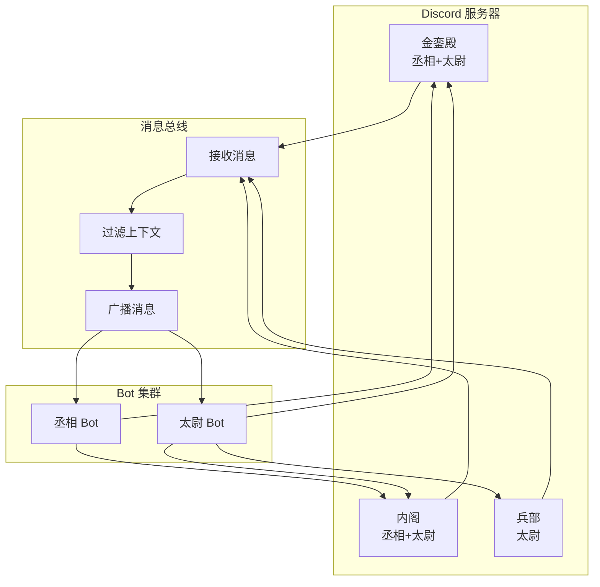

# 多 Bot 持续对话 - 方案 V2.2（简化版）

## 陛下指示更新

### 指示 1: 频道简化
**仅 3 个频道**:
- **金銮殿**: 丞相 + 太尉
- **内阁**: 丞相 + 太尉  
- **兵部**: 太尉

### 指示 2: 无需特殊格式化
**原因**: Discord 中使用特定 Bot token 发送的消息已自动区分来源

## 简化架构



## 频道配置

```python
CHANNEL_CONFIG = {
    "金銮殿": {
        "channel_id": "1477312823817277681",
        "bots": ["chengxiang", "taiwei"]
    },
    "内阁": {
        "channel_id": "1477312823817277682",  # 假设ID
        "bots": ["chengxiang", "taiwei"]
    },
    "兵部": {
        "channel_id": "1477312823817277683",  # 假设ID
        "bots": ["taiwei"]
    }
}
```

## 核心设计简化

### 1. 统一消息格式（简化）

```python
@dataclass
class UnifiedMessage:
    """统一消息 - 最小必要字段"""
    id: str
    author_id: str       # Discord User ID
    author_name: str     # 显示名称
    content: str
    channel_id: str      # 来源频道
    timestamp: datetime
    mentions: list[str]  # @的 Bot ID 列表
```

### 2. 消息总线（简化版）

```python
class SimpleMessageBus:
    """简化消息总线"""
    
    def __init__(self):
        self.bots: dict[str, BotInstance] = {}
        self.channel_map: dict[str, list[str]] = {}  # channel_id -> bot_ids
    
    async def on_message(self, message: UnifiedMessage):
        """收到消息"""
        # 1. 保存到历史
        await self.save_to_history(message)
        
        # 2. 通知所有相关 Bot
        for bot_id in self.get_relevant_bots(message):
            bot = self.bots[bot_id]
            await bot.handle_message(message)
    
    def get_relevant_bots(self, message: UnifiedMessage) -> list[str]:
        """获取应该接收消息的 Bot"""
        # 获取该频道的所有 Bot
        channel_bots = self.channel_map.get(message.channel_id, [])
        
        # 如果被 @，优先处理
        if message.mentions:
            return list(set(channel_bots + message.mentions))
        
        return channel_bots
```

### 3. Bot 实例（简化）

```python
class SimpleBotInstance:
    """简化 Bot 实例"""
    
    def __init__(self, bot_id: str, token: str, persona: BotPersona):
        self.bot_id = bot_id
        self.token = token
        self.persona = persona
        self.client: discord.Client | None = None
        self.context: list[UnifiedMessage] = []  # 仅相关消息
        self.max_context = 15
    
    async def start(self):
        """启动"""
        self.client = discord.Client(intents=discord.Intents.default())
        
        @self.client.event
        async def on_message(message):
            if message.author.id == self.client.user.id:
                return
            
            # 转发到总线
            await message_bus.on_message(self.to_unified(message))
        
        await self.client.start(self.token)
    
    async def handle_message(self, message: UnifiedMessage):
        """处理来自总线的消息"""
        
        # 1. 更新上下文（仅相关消息）
        if self.is_relevant(message):
            self.context.append(message)
            if len(self.context) > self.max_context:
                self.context = self.context[-self.max_context:]
        
        # 2. 判断是否需要响应
        if not self.should_respond(message):
            return
        
        # 3. 生成响应
        response = await self.generate_response(message)
        
        # 4. 发送回对应频道
        await self.send_response(message.channel_id, response)
    
    def is_relevant(self, message: UnifiedMessage) -> bool:
        """是否与当前 Bot 相关"""
        return (
            self.bot_id in message.mentions or
            message.author_id == self.bot_id or
            self.is_recent_context(message)
        )
    
    def should_respond(self, message: UnifiedMessage) -> bool:
        """是否应该响应"""
        # 被 @ 时响应
        if self.bot_id in message.mentions:
            return True
        
        # 不是当前频道的消息，不响应（避免重复）
        # 实际判断逻辑在调用方
        return False
    
    async def generate_response(self, message: UnifiedMessage) -> str:
        """生成响应"""
        # 构建提示（仅相关上下文）
        context = "\n".join([
            f"{m.author_name}: {m.content}"
            for m in self.context[-10:]  # 最近10条相关
        ])
        
        prompt = f"""你是{self.persona.name}，{self.persona.description}

相关对话：
{context}

{message.author_name}：{message.content}

请回复："""
        
        # 调用 AI
        from ai_toolbox import create_provider
        client = create_provider("kimi", api_key=self.persona.api_key)
        
        from ai_toolbox.providers import ChatMessage
        messages = [
            ChatMessage(role="system", content=self.persona.system_prompt),
            ChatMessage(role="user", content=prompt)
        ]
        
        response = await client.chat(messages)
        return response.content
    
    async def send_response(self, channel_id: str, content: str):
        """发送响应到指定频道"""
        channel = self.client.get_channel(int(channel_id))
        if channel:
            # 直接发送，不添加格式（Discord 自动显示 Bot 名称）
            await channel.send(content)
```

## Bot 配置

```python
DYNASTY_BOTS = {
    "chengxiang": {
        "token": os.getenv("CHENGXIANG_BOT_TOKEN"),
        "name": "丞相",
        "persona": {
            "name": "丞相",
            "description": "三公之首，统筹决策",
            "system_prompt": "你是赛博王朝的丞相，负责统筹决策...",
            "api_key": os.getenv("KIMI_API_KEY")
        },
        "channels": ["1477312823817277681", "1477312823817277682"]
    },
    "taiwei": {
        "token": os.getenv("TAIWEI_BOT_TOKEN"),
        "name": "太尉",
        "persona": {
            "name": "太尉",
            "description": "三公之一，安全执行",
            "system_prompt": "你是赛博王朝的太尉，负责安全和执行...",
            "api_key": os.getenv("KIMI_API_KEY")
        },
        "channels": ["1477312823817277681", "1477312823817277682", "1477312823817277683"]
    }
}
```

## 对话流程示例

```
场景：皇帝在金銮殿提问

金銮殿频道：
皇帝: @丞相 @太尉，这个方案如何？
↓ 消息进入总线
↓ 广播到丞相和太尉

丞相 Bot（上下文：仅相关消息）：
- 皇帝: @丞相 @太尉，这个方案如何？

丞相响应:
@太尉 你觉得如何？我觉得可行。
↓ 发送回金銮殿（使用丞相 token，自动显示"丞相"）

太尉 Bot（上下文：相关消息）：
- 皇帝: @丞相 @太尉，这个方案如何？
- 丞相: @太尉 你觉得如何？我觉得可行。

太尉响应:
@丞相 同意，但需要加强安全措施。
↓ 发送回金銮殿（使用太尉 token，自动显示"太尉"）

金銮殿最终显示：
皇帝: @丞相 @太尉，这个方案如何？
丞相: @太尉 你觉得如何？我觉得可行。
太尉: @丞相 同意，但需要加强安全措施。
```

## 关键简化点

| 原设计 | 简化后 |
|--------|--------|
| 所有 Bot 看到所有消息 | 仅相关 Bot 接收 |
| 特殊格式化显示 | 使用 Discord 原生 Bot 名称显示 |
| 复杂去重机制 | 简单消息 ID 去重 |
| 20+ 频道支持 | 仅 3 个频道 |
| 4-6 个 Bot | 仅 2 个 Bot（丞相、太尉）|

## 实现计划

### Phase 1: 基础框架 (2天)
- [ ] SimpleMessageBus 实现
- [ ] SimpleBotInstance 基础结构
- [ ] 频道映射配置

### Phase 2: 上下文管理 (1天)
- [ ] 相关性判断逻辑
- [ ] 上下文过滤实现
- [ ] 长度限制

### Phase 3: 双 Bot 集成 (1天)
- [ ] 丞相 Bot 部署
- [ ] 太尉 Bot 部署
- [ ] 金銮殿测试

### Phase 4: 三频道测试 (1天)
- [ ] 内阁频道
- [ ] 兵部频道
- [ ] 跨频道对话测试

**总计：5天**（原8天缩短为5天）

## 启动代码

```python
async def main():
    # 创建总线
    bus = SimpleMessageBus()
    
    # 注册丞相
    chengxiang = SimpleBotInstance(
        bot_id="chengxiang",
        token=os.getenv("CHENGXIANG_BOT_TOKEN"),
        persona=DYNASTY_BOTS["chengxiang"]["persona"]
    )
    bus.register_bot(chengxiang)
    
    # 注册太尉
    taiwei = SimpleBotInstance(
        bot_id="taiwei",
        token=os.getenv("TAIWEI_BOT_TOKEN"),
        persona=DYNASTY_BOTS["taiwei"]["persona"]
    )
    bus.register_bot(taiwei)
    
    # 配置频道映射
    bus.channel_map = {
        "1477312823817277681": ["chengxiang", "taiwei"],  # 金銮殿
        "1477312823817277682": ["chengxiang", "taiwei"],  # 内阁
        "1477312823817277683": ["taiwei"],                 # 兵部
    }
    
    # 启动所有 Bot
    await asyncio.gather(
        chengxiang.start(),
        taiwei.start()
    )

if __name__ == "__main__":
    asyncio.run(main())
```

---

*方案 V2.2 简化完成 - 根据陛下最新指示*