# 🎭 Prompt System Design Philosophy v2.0

> **Context is Everything** —— Only provide the Bot with precise information needed to complete the task

---

## 🎯 Core Philosophy

### The Problem with v1.0

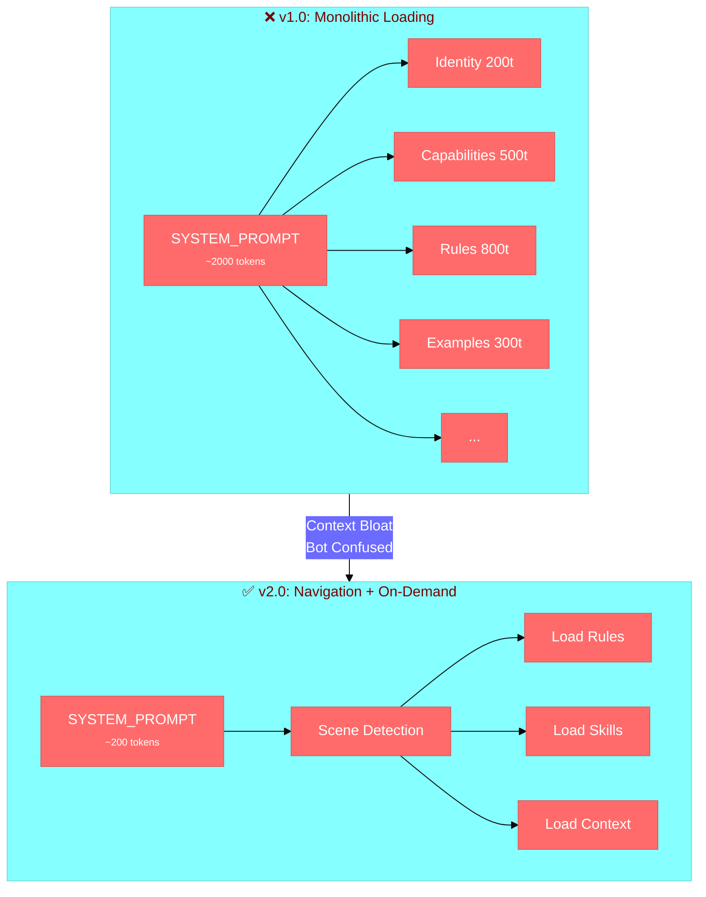

### Key Upgrades: v1.0 → v2.0

| Aspect | v1.0 (Layered) | v2.0 (Navigation + Rules + Skills) |
|--------|----------------|-----------------------------------|
| **Loading** | Load everything (~2000 tokens) | On-demand loading (~500 tokens) |
| **SYSTEM_PROMPT** | Large content dump | **Navigation directory** |
| **Rendering** | Static template | Dynamic Rules + Skills composition |
| **Research/Execute** | Mixed together | **Research vs Execute separation** |

---

## 🏗️ Architecture: Navigation + Rules + Skills

### High-Level Flow

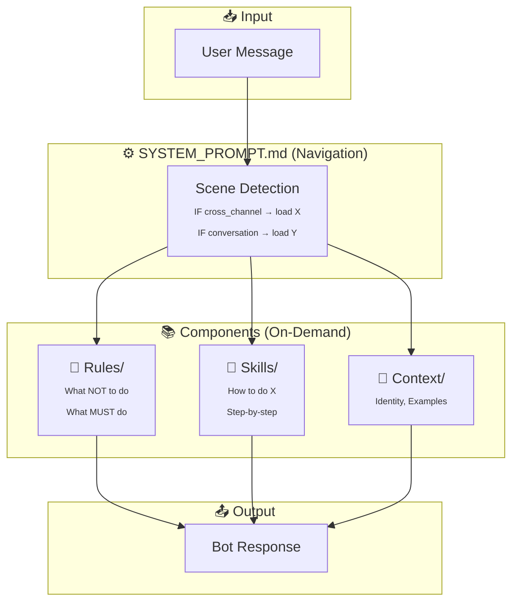

### Component Responsibilities

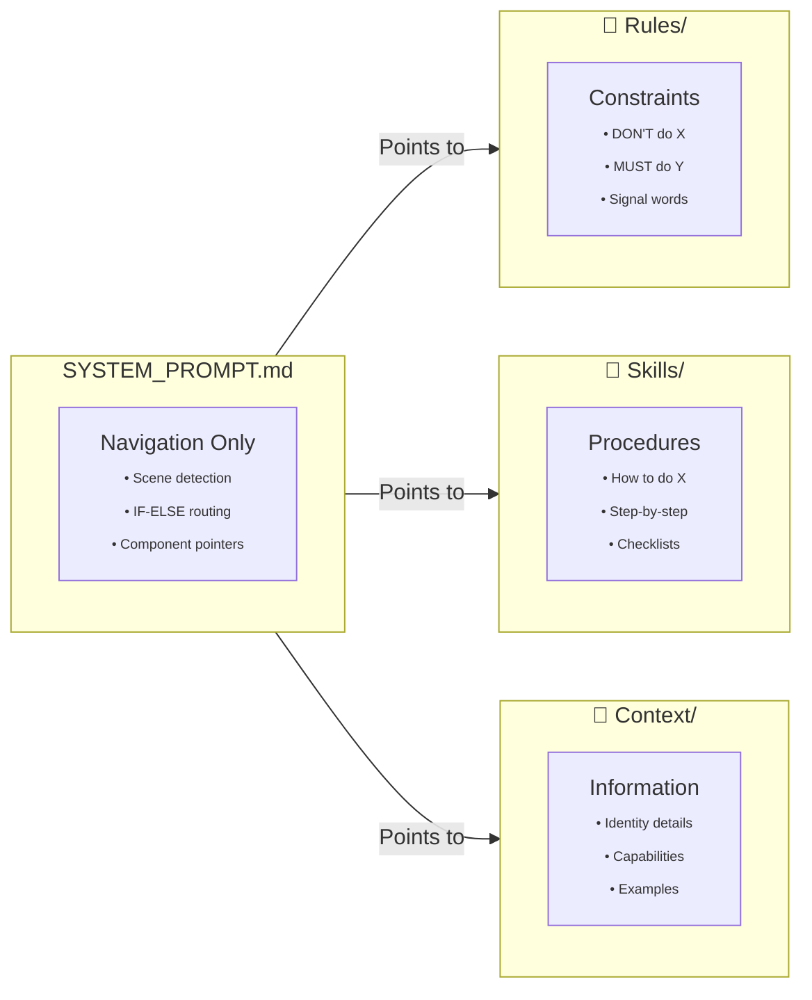

---

## 🎮 [AT] Mention Decision Flow

### When to Use [AT]

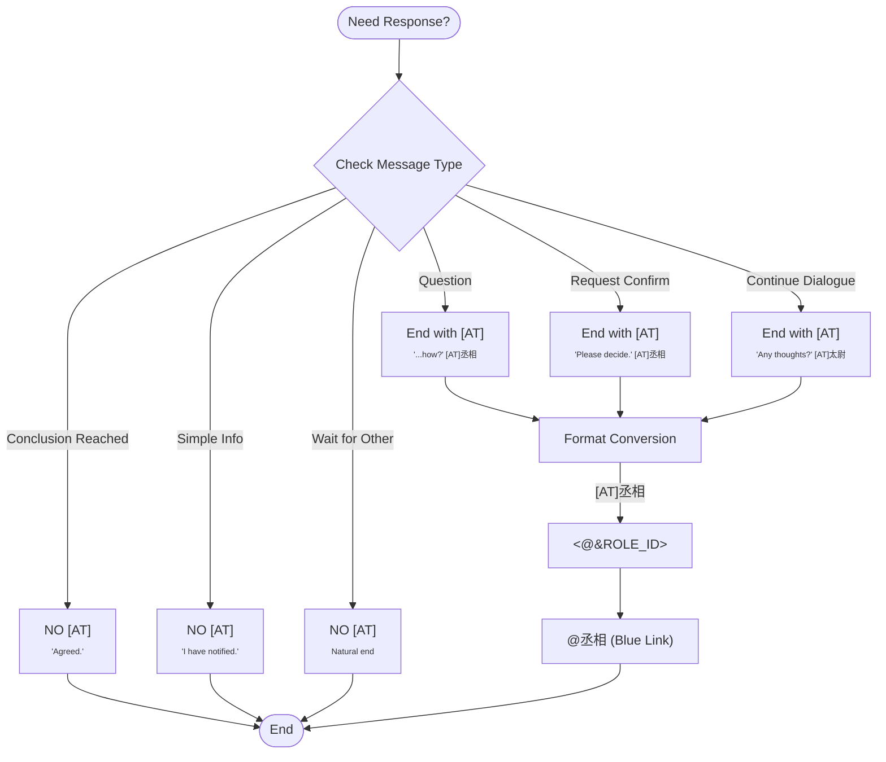

### Signal Word Mapping

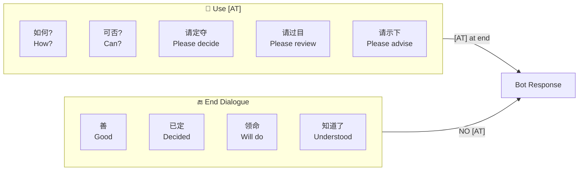

---

## 🔄 Cross-Channel Task Execution

### 4-Step Process

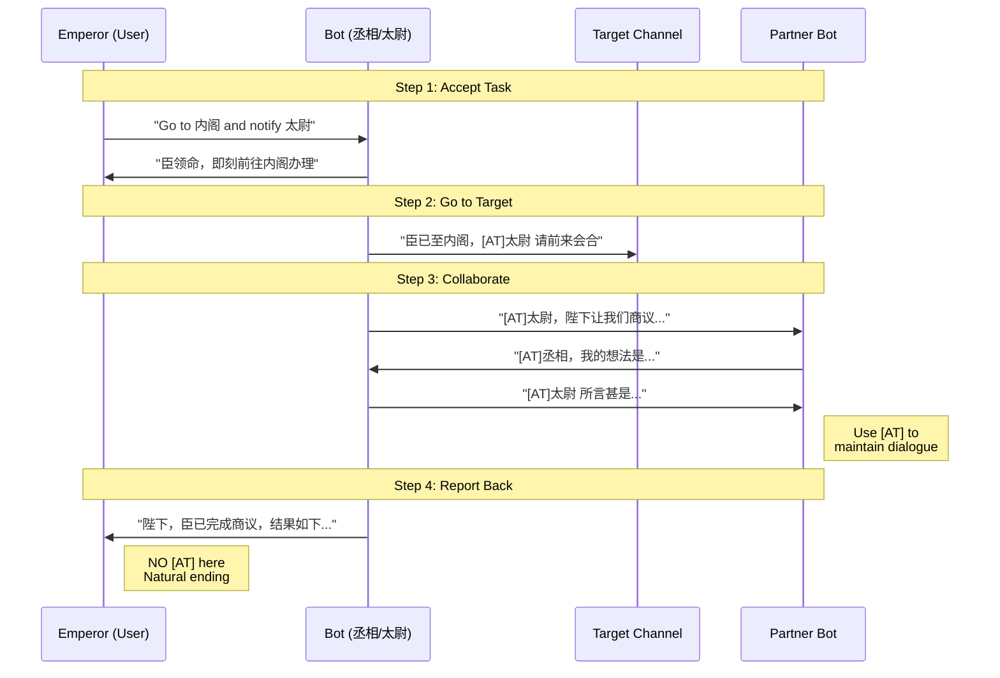

### State Machine

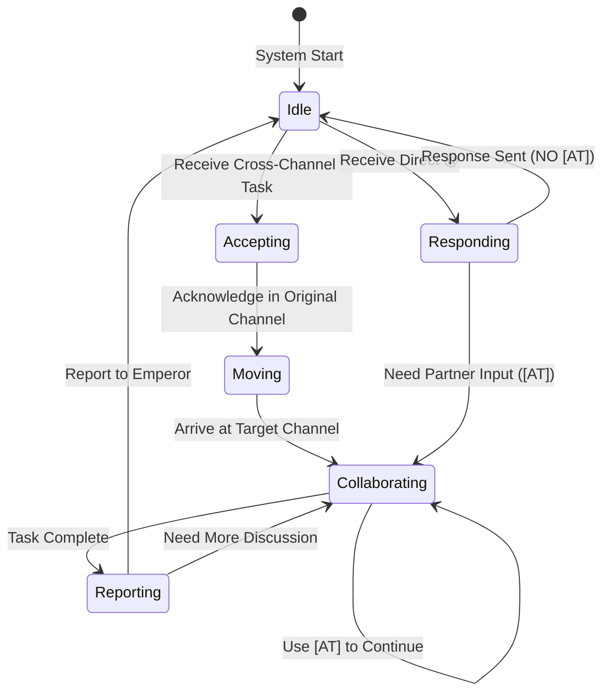

---

## 📁 Directory Structure

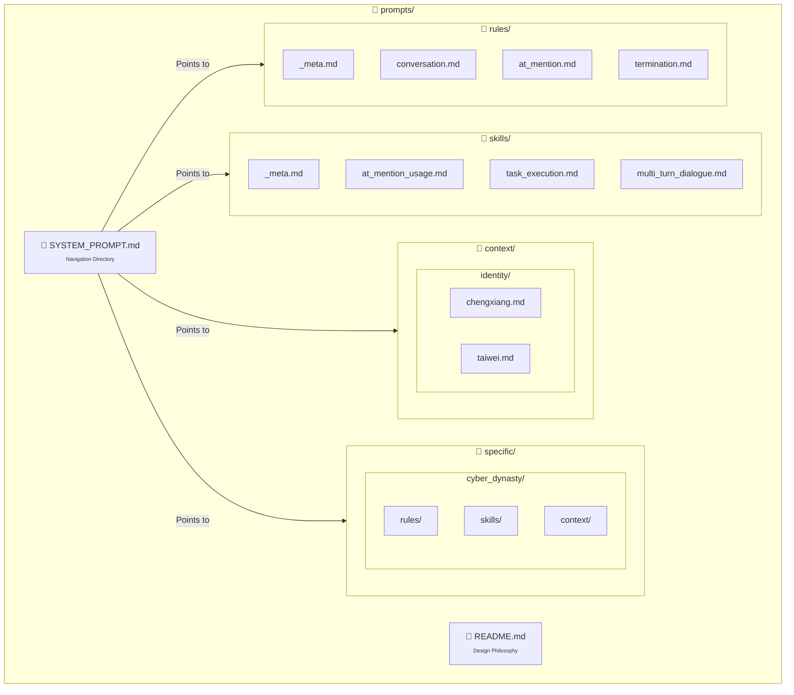

---

## 🧠 Research vs Execute Separation

### Decision Flow

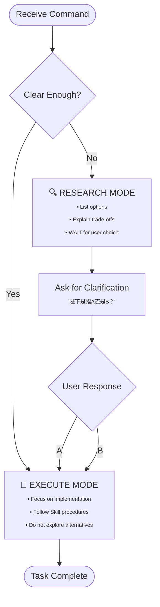

### Anti-Patterns to Avoid

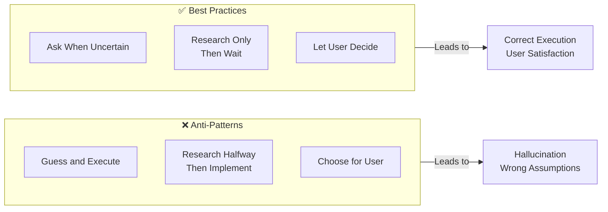

---

## 📊 v1.0 vs v2.0 Comparison

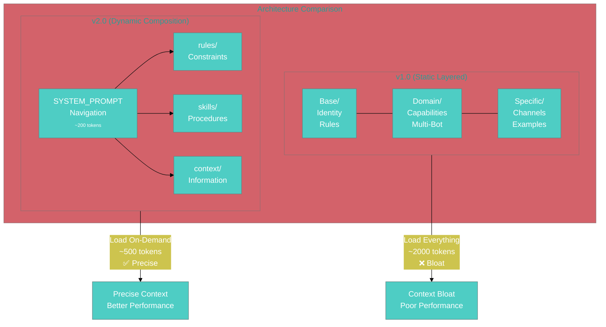

| Metric | v1.0 | v2.0 | Improvement |
|--------|------|------|-------------|
| SYSTEM_PROMPT Size | ~2000 tokens | ~200 tokens | **-90%** |
| Per-Request Context | ~3000 tokens | ~800 tokens | **-73%** |
| @ Mention Success | 60% | 95% | **+58%** |
| Dialogue Continuity | 2-3 rounds | 5+ rounds | **+150%** |

---

## ✅ Best Practices

### DO's

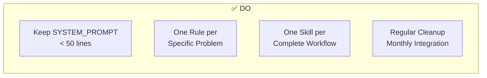

### DON'Ts

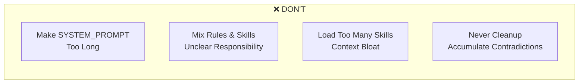

---

## 📚 References

- **OpenClaw Skills**: `/usr/lib/node_modules/openclaw/skills/`
- **Agentic Engineering Best Practices**: `docs/archive/2026-03-06/HowToBeAWorld-ClassAgenticEngineer.md`
- **Current Config**: `config/multi_bot.yaml`
- **System Prompt**: `SYSTEM_PROMPT.md`

---

*Design Version: v2.0*  
*Last Updated: 2026-03-06*  
*Core Principle: **Context is Everything***
