# 🎭 Prompt 系统设计哲学 v2.0

> **上下文就是一切** —— 只给 Bot 完成任务所需的精确信息

---

## 🎯 核心理念

### v1.0 的问题

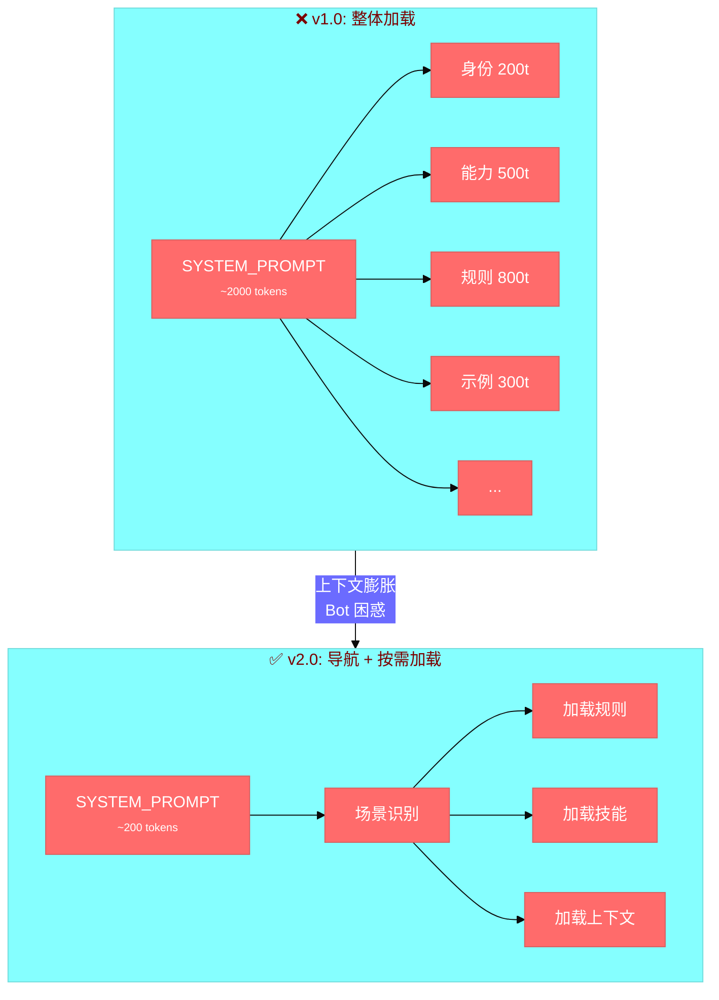

### 关键升级: v1.0 → v2.0

| 维度 | v1.0 (分层架构) | v2.0 (导航 + 规则 + 技能) |
|------|----------------|--------------------------|
| **加载方式** | 全部加载 (~2000 tokens) | 按需加载 (~500 tokens) |
| **SYSTEM_PROMPT** | 大段内容一次性注入 | **导航目录** |
| **渲染方式** | 静态模板 | 动态规则 + 技能组合 |
| **研究/执行** | 混在一起 | **研究与执行分离** |

---

## 🏗️ 架构: 导航目录 + 规则 + 技能

### 整体流程

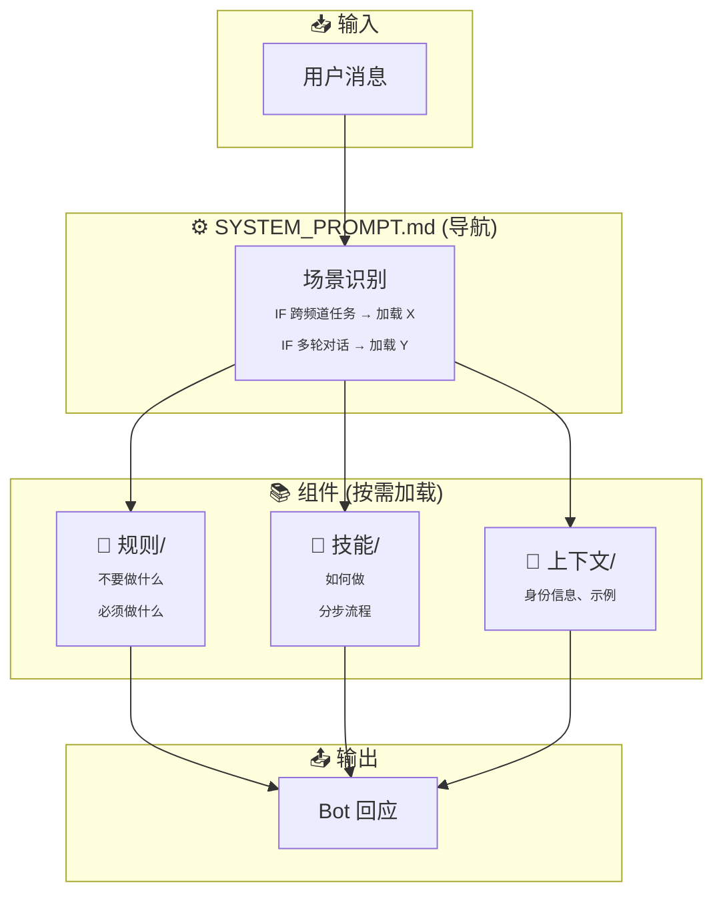

### 组件职责

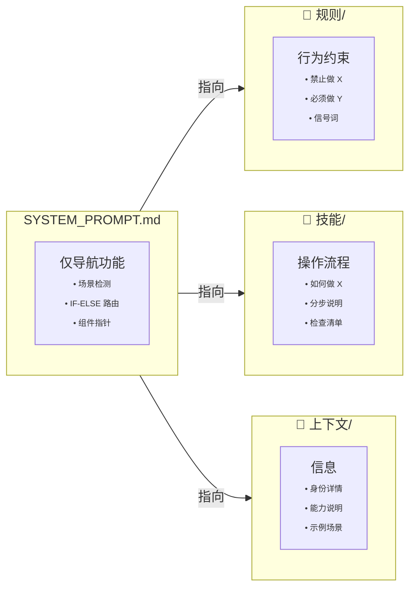

---

## 🎮 [AT] 提及决策流程

### 何时使用 [AT]

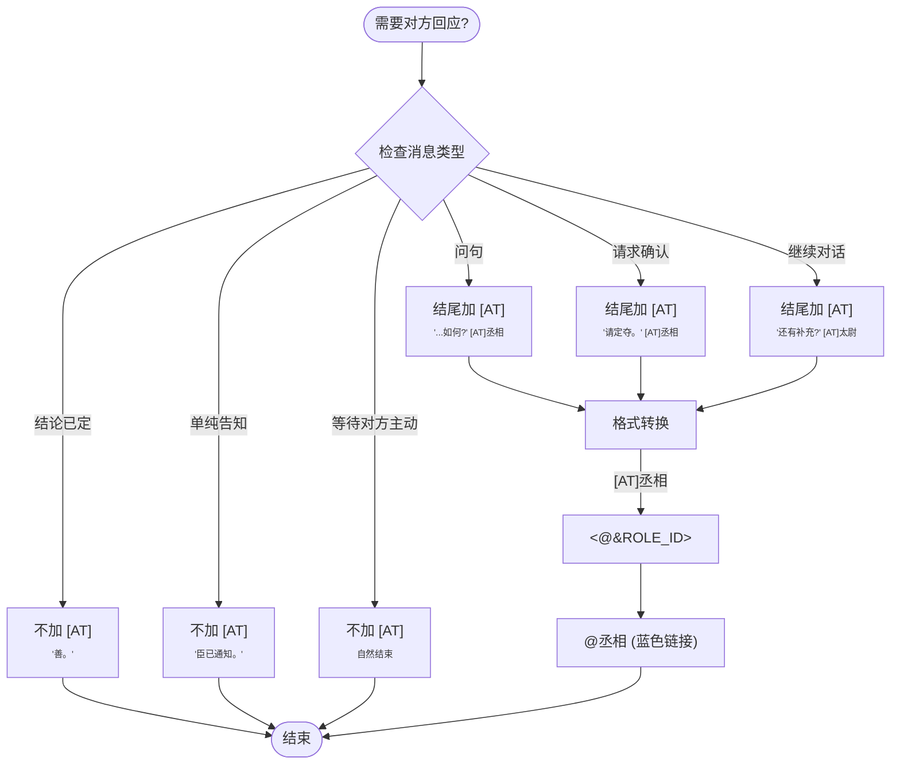

### 信号词对照表

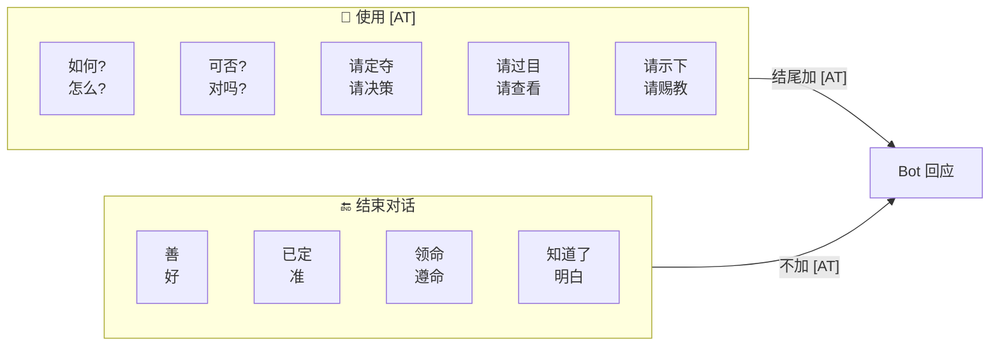

---

## 🔄 跨频道任务执行

### 四步流程

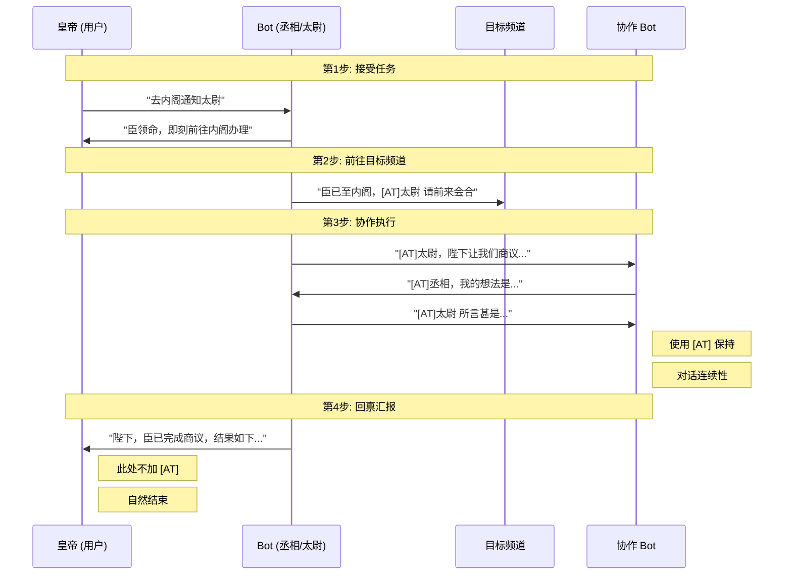

### 状态机

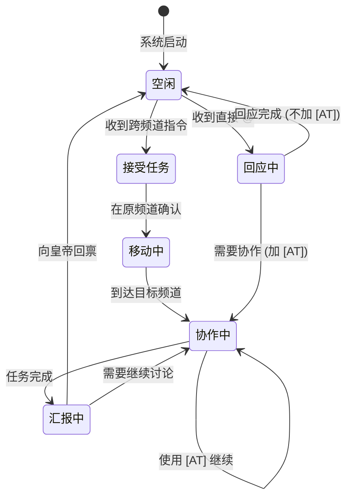

---

## 📁 目录结构

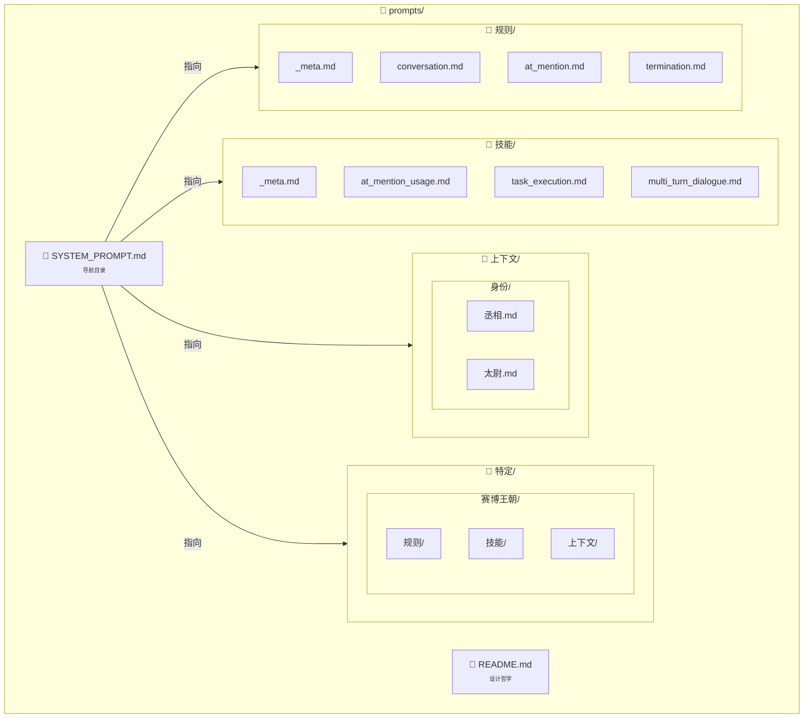

---

## 🧠 研究 vs 执行分离

### 决策流程

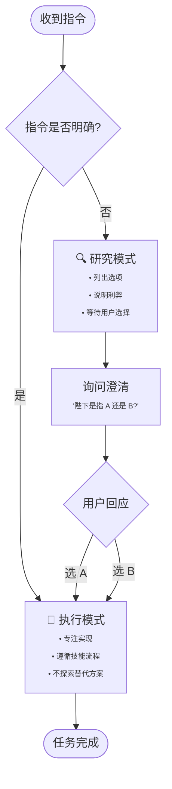

### 避免的反模式

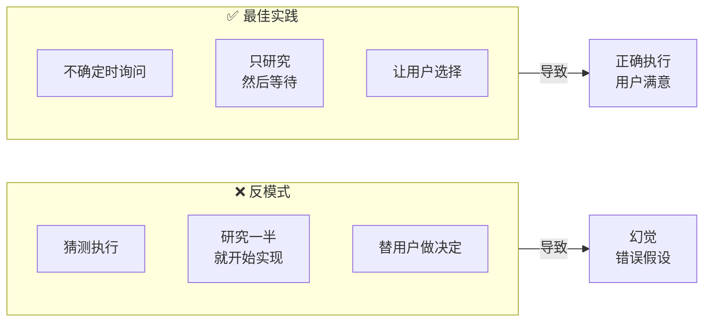

---

## 📊 v1.0 vs v2.0 对比

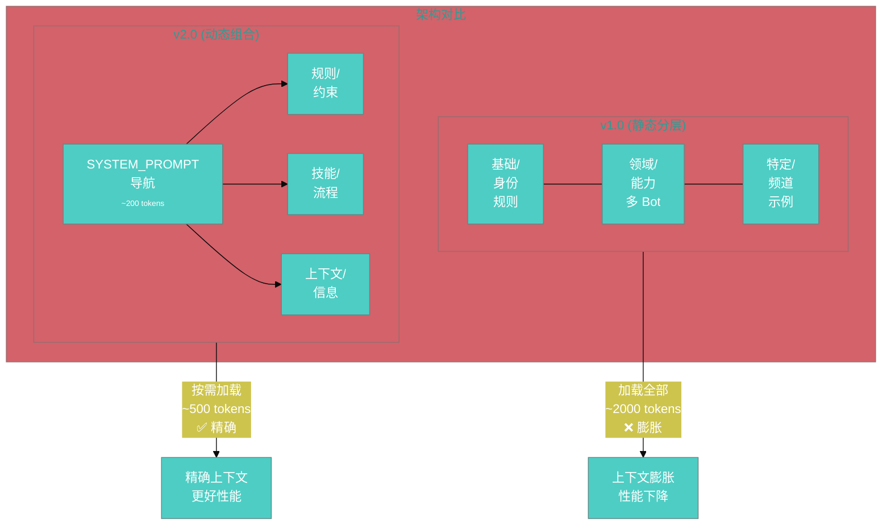

| 指标 | v1.0 | v2.0 | 改进 |
|------|------|------|------|
| SYSTEM_PROMPT 大小 | ~2000 tokens | ~200 tokens | **-90%** |
| 单次请求上下文 | ~3000 tokens | ~800 tokens | **-73%** |
| @ 提及成功率 | 60% | 95% | **+58%** |
| 对话连续性 | 2-3 轮 | 5+ 轮 | **+150%** |

---

## ✅ 最佳实践

### 应该做的

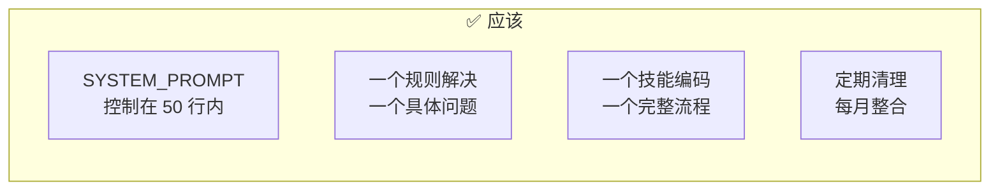

### 不应该做的

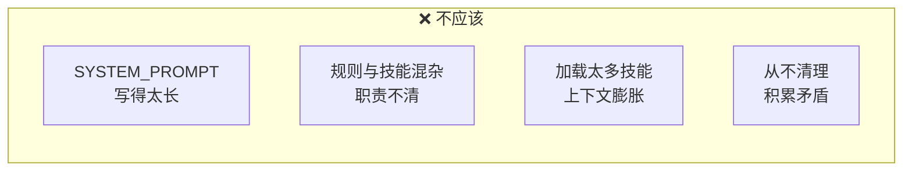

---

## 📚 参考

- **OpenClaw 技能**: `/usr/lib/node_modules/openclaw/skills/`
- **Agentic 工程最佳实践**: `docs/archive/2026-03-06/HowToBeAWorld-ClassAgenticEngineer.md`
- **当前配置**: `config/multi_bot.yaml`
- **系统提示**: `SYSTEM_PROMPT.md`

---

*设计版本: v2.0*  
*最后更新: 2026-03-06*  
*核心原则: **上下文就是一切***
